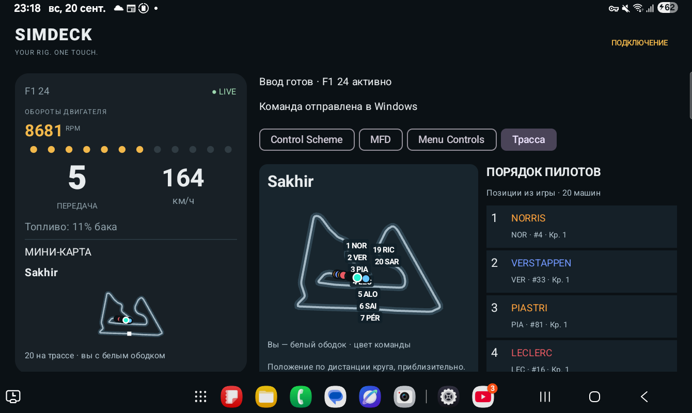
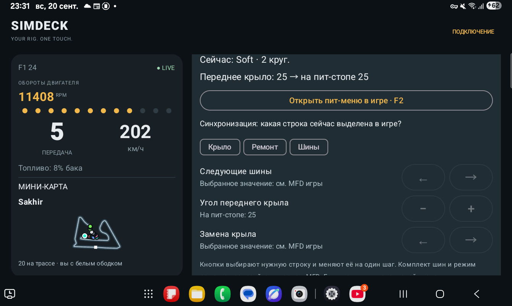
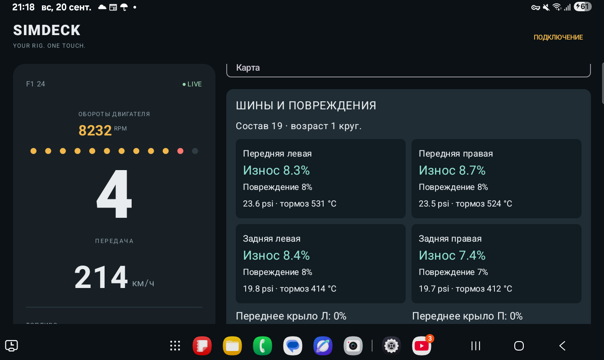
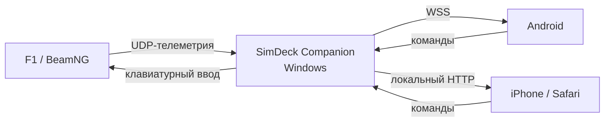

<h1 align="center">SIMDECK</h1>

<p align="center"><strong>Your rig. One touch.</strong></p>

<p align="center">
  
  
  
  
</p>

<p align="center">
  <a href="https://github.com/timurgass/SimDeck/releases/tag/v0.7.3"><strong>Скачать SimDeck 0.7.3</strong></a>
  · <a href="#быстрый-запуск">Быстрый запуск</a>
  · <a href="TROUBLESHOOTING.md">Решение проблем</a>
</p>

<p align="center">
  
</p>

SimDeck превращает Android-планшет, телефон или Safari на iPhone в дополнительную панель управления для **F1 24**, **F1 25** и **BeamNG.drive**. Игра передаёт телеметрию в Windows Companion, а Companion показывает приборы и отправляет игровые команды с выбранного устройства.

> [!NOTE]
> Это ранняя тестовая версия. Основные сценарии работают, но проект ещё не достиг версии 1.0.

## Скачать

| Файл | Для чего нужен |
|---|---|
| [SimDeck-0.7.3-Windows.zip](https://github.com/timurgass/SimDeck/releases/download/v0.7.3/SimDeck-0.7.3-Windows.zip) | Автономный Windows Companion x64 |
| [SimDeck-0.7.3-debug.apk](https://github.com/timurgass/SimDeck/releases/download/v0.7.3/SimDeck-0.7.3-debug.apk) | Клиент для Android 10 и новее |
| [SimDeck-F1-Preset-0.7.1.zip](https://github.com/timurgass/SimDeck/releases/download/v0.7.3/SimDeck-F1-Preset-0.7.1.zip) | Установщик Keyboard Preset 2 для F1 24 и F1 25 |
| [SimDeck-0.2.1-BeamNG.zip](https://github.com/timurgass/SimDeck/releases/download/v0.7.3/SimDeck-0.2.1-BeamNG.zip) | Мод расширенной телеметрии BeamNG.drive |
| [SimDeck-0.7.3-SHA256SUMS.txt](https://github.com/timurgass/SimDeck/releases/download/v0.7.3/SimDeck-0.7.3-SHA256SUMS.txt) | Контрольные суммы файлов релиза |

Для iPhone отдельное приложение не требуется: локальный Safari-пульт запускается из Companion.

## Возможности

- Живая скорость, RPM, передача, топливо и состояние педалей.
- Температура, давление, износ и повреждения каждого колеса в F1.
- Карта трассы, положение машин и порядок пилотов.
- Настройка следующего пит-стопа: переднее крыло, ремонт и состав шин.
- Готовые запросы инженеру и управление игровыми меню.
- Настраиваемые кнопки и сочетания с `Ctrl`, `Alt` и `Shift`.
- Подтверждённые состояния света и переключателей BeamNG.
- Android-клиент и полнофункциональный локальный пульт для Safari.
- Защищённое сопряжение, отзыв доступа и один активный контроллер.
- Два режима Windows-ввода: Scan Code и совместимый Virtual-Key.

## Поддерживаемые игры

| Игра | Телеметрия | Управление | Особенности |
|---|---|---|---|
| **F1 24** | UDP 2024 | 69 действий | Трассы, пилоты, колёса, повреждения, инженер, пит-стоп |
| **F1 25** | UDP 2025 и совместимый 2024 | 69 действий | Тот же готовый профиль и отдельный процесс `F1_25` |
| **BeamNG.drive** | Мод SimDeck, резервный OutGauge | 22 действия | Реальная передача, режим коробки, свет, привод и возврат машины |

Подробные назначения: [F1 24](F1-24-PROFILE.md) · [F1 25](F1-25-PROFILE.md) · [BeamNG.drive](BEAMNG-PROFILE.md)

## Интерфейс

| Пит-стоп | Состояние колёс |
|---|---|
|  |  |

## Быстрый запуск

### 1. Запустите Companion

1. Скачайте и полностью распакуйте `SimDeck-0.7.3-Windows.zip`.
2. Запустите `SimDeck.exe`. Переносить один EXE из папки нельзя.
3. Выберите профиль игры и оставьте Companion запущенным.

Запуск от имени администратора обычно не нужен. Игра и Companion должны работать с одинаковыми правами.

### 2. Подключите устройство

**Android**

1. Установите APK.
2. Подключите ПК и устройство к одной домашней сети.
3. В Companion нажмите **«Подключить планшет»**.
4. На Android выберите ПК, сравните все 64 символа отпечатка и введите двухминутный код.

**iPhone / Safari**

1. В Companion нажмите **«Подключить iPhone / Safari · тест»**.
2. Откройте показанный адрес в Safari в той же сети.
3. Введите код сопряжения.

После перезапуска Companion для Safari требуется новый код. Новое успешное сопряжение отключает ранее подключённый контроллер.

### 3. Настройте игру

<details>
<summary><strong>F1 24 / F1 25</strong></summary>

1. Полностью распакуйте `SimDeck-F1-Preset-0.7.1.zip`.
2. Закройте игру.
3. Запустите `Install-F1-24.cmd` или `Install-F1-25.cmd` из распакованной папки.
4. В игре выберите изменённый **Keyboard Preset 2**.
5. Включите UDP:

| Параметр | Значение |
|---|---|
| UDP Telemetry | On |
| UDP Broadcast Mode | Off |
| UDP IP Address | `127.0.0.1` |
| UDP Port | `20777` |
| UDP Send Rate | `60 Hz` |
| UDP Format | `2024` для F1 24, `2025` для F1 25 |

Установщик создаёт резервную копию и изменяет только Keyboard Preset 2. Полные инструкции: [F1 24](F1-24-PROFILE.md) и [F1 25](F1-25-PROFILE.md).

</details>

<details>
<summary><strong>BeamNG.drive</strong></summary>

1. Скопируйте `SimDeck-0.2.1-BeamNG.zip` в пользовательскую папку BeamNG `mods`. Архив распаковывать не нужно.
2. Убедитесь, что мод включён и игре разрешены сторонние протоколы.
3. Перезагрузите машину через `Ctrl+R` либо загрузите её заново.
4. В Companion выберите BeamNG и UDP-порт `4444`.

Подробности: [установка телеметрии BeamNG](beamng/README.md).

</details>

### 4. Включите управление

1. В Companion включите **«Разрешить клавиатурный ввод»**.
2. Вернитесь в окно игры: команды работают только когда выбранная игра активна.
3. Если Companion показывает `injected`, но игра не реагирует, включите **«Совместимый ввод Virtual-Key»**.

Телеметрия и управление работают независимо. Приборы могут обновляться, пока кнопки серые из-за выключенного ввода или неактивного окна игры.

## Как это работает



Вся связь остаётся внутри локальной сети. Companion не меняет Windows Firewall автоматически. Если Windows запрашивает сетевой доступ, разрешите его только для частной сети.

## Особенности управления BeamNG

- В аркадном режиме коробка отображается как `D / N / R`.
- В реалистичном режиме отображаются `R / N / 1 / 2 / 3…` с реальным числом передач автомобиля.
- Ближний свет подсвечивается зелёным, дальний — синим.
- Переключатели с подтверждённым состоянием остаются визуально нажатыми.
- Зажигание использует строгую последовательность: отдельное короткое нажатие, затем отдельное удержание для запуска двигателя.

## Диагностика

| Симптом | Что проверить |
|---|---|
| Телеметрия есть, кнопки серые | Включите ввод и верните фокус окну игры |
| Команда показывает `injected`, игра не реагирует | Включите режим Virtual-Key |
| F1 не показывает данные | Проверьте UDP `127.0.0.1:20777`, формат и счётчики пакетов в Companion |
| BeamNG не показывает данные | Проверьте мод, порт `4444` и перезагрузите машину через `Ctrl+R` |
| Safari долго загружается | Проверьте одну Wi-Fi-сеть и откройте новый адрес после перезапуска Companion |

Полное руководство: [TROUBLESHOOTING.md](TROUBLESHOOTING.md).

## Документация

- [История изменений](RELEASE-NOTES.md)
- [Результаты проверок](VALIDATION.md)
- [Профиль F1 24](F1-24-PROFILE.md)
- [Профиль F1 25](F1-25-PROFILE.md)
- [Профиль BeamNG.drive](BEAMNG-PROFILE.md)
- [Протокол Companion ↔ клиент](protocol/README.md)
- [Телеметрия BeamNG](beamng/README.md)

## Сборка из исходников

<details>
<summary>Требования и команды</summary>

Требуются .NET SDK **10.0.401**, Java 17, Android SDK platform 35 и build-tools 36.0.0. Gradle Wrapper **8.9** находится в `android/`.

```powershell
dotnet build companion/SimDeck.App/SimDeck.App.csproj -c Release
dotnet run --project companion/SimDeck.Tests/SimDeck.Tests.csproj -c Release
dotnet publish companion/SimDeck.App/SimDeck.App.csproj -c Release -r win-x64 --self-contained true -o artifacts/Companion

cd android
.\gradlew.bat testDebugUnitTest assembleDebug
```

Android SDK задаётся через `ANDROID_HOME` или локальный `android/local.properties`. Для отдельного тестового профиля используйте `SimDeck.exe --data-dir <папка>`, для демонстрационных приборов — `SimDeck.exe --demo`.

</details>

## Текущий статус

В версии 0.7.3 проходят **158 проверок .NET** и Android unit tests. На реальном оборудовании проверены Android-интерфейс, Safari, телеметрия и игровые команды F1 24. Для F1 25 остаётся полный ручной прогон всех 69 действий. До версии 1.0 также планируются независимый watchdog и дальнейшая проверка устойчивости Wi-Fi.

Настройки Companion находятся в `%LOCALAPPDATA%/SimDeck/settings.json`. Доверенные устройства можно отключить кнопкой **«Отозвать доступ»**.
