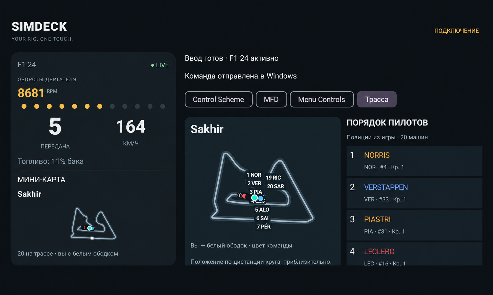
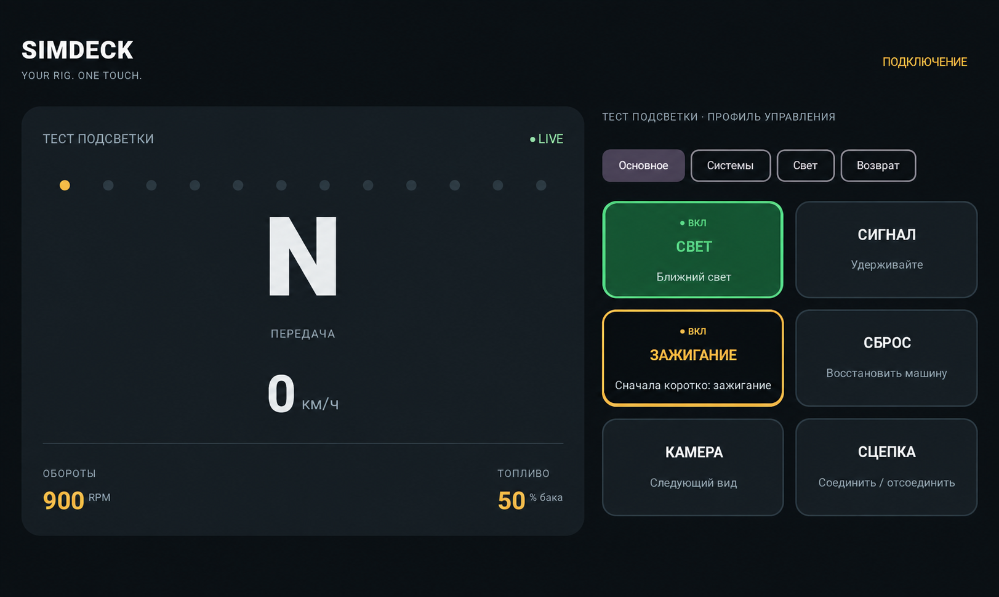
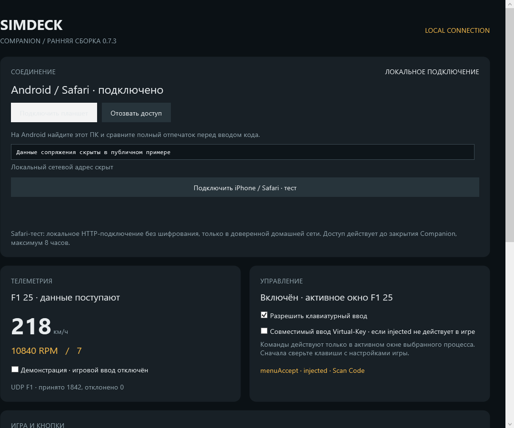
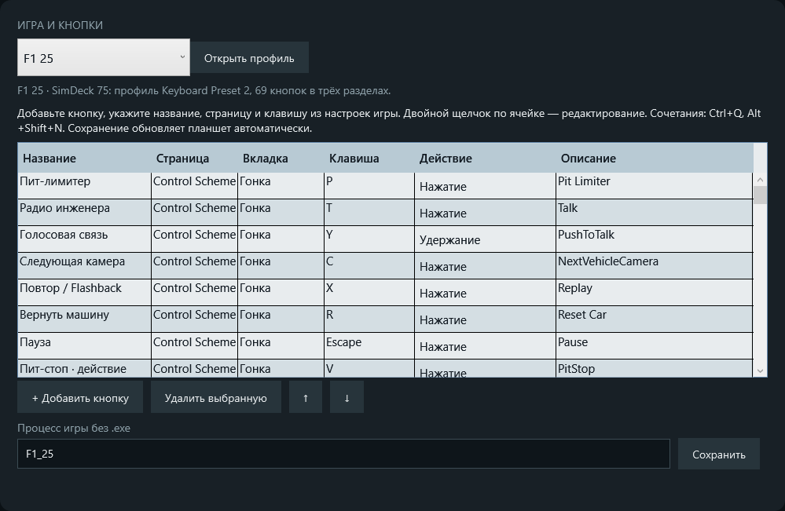
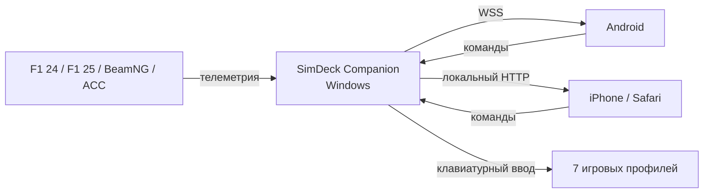

<h1 align="center">SIMDECK</h1>

<p align="center"><strong>Your rig. One touch.</strong></p>

<p align="center">
  
  
  
  
</p>

<p align="center">
  <a href="https://github.com/timurgass/SimDeck/releases/tag/v0.8.3"><strong>Скачать SimDeck 0.8.3</strong></a>
  · <a href="#быстрый-запуск">Быстрый запуск</a>
  · <a href="TROUBLESHOOTING.md">Решение проблем</a>
</p>

SimDeck превращает Android-планшет, телефон или Safari на iPhone в дополнительную панель управления для **F1 24**, **F1 25**, **BeamNG.drive**, **Assetto Corsa Competizione**, **Automobilista 2**, **Euro Truck Simulator 2** и **SnowRunner**. Companion показывает доступную телеметрию и отправляет игровые команды с выбранного устройства.

> [!NOTE]
> Это ранняя тестовая версия. Основные сценарии работают, но проект ещё не достиг версии 1.0.

## Скачать

| Файл | Для чего нужен |
|---|---|
| [SimDeck-0.8.3-Windows.zip](https://github.com/timurgass/SimDeck/releases/download/v0.8.3/SimDeck-0.8.3-Windows.zip) | Автономный Windows Companion x64 |
| [SimDeck-0.8.3-debug.apk](https://github.com/timurgass/SimDeck/releases/download/v0.8.3/SimDeck-0.8.3-debug.apk) | Клиент для Android 10 и новее |
| [SimDeck-ACC-Preset-0.8.3.zip](https://github.com/timurgass/SimDeck/releases/download/v0.8.3/SimDeck-ACC-Preset-0.8.3.zip) | 33 команды ACC, ручное зажигание и резервные копии настроек |
| [SimDeck-F1-Preset-0.7.1.zip](https://github.com/timurgass/SimDeck/releases/download/v0.8.3/SimDeck-F1-Preset-0.7.1.zip) | Установщик Keyboard Preset 2 для F1 24 и F1 25 |
| [SimDeck-0.2.1-BeamNG.zip](https://github.com/timurgass/SimDeck/releases/download/v0.8.3/SimDeck-0.2.1-BeamNG.zip) | Мод расширенной телеметрии BeamNG.drive |
| [SimDeck-0.8.3-SHA256SUMS.txt](https://github.com/timurgass/SimDeck/releases/download/v0.8.3/SimDeck-0.8.3-SHA256SUMS.txt) | Контрольные суммы файлов релиза |

Для iPhone отдельное приложение не требуется: локальный Safari-пульт запускается из Companion.

## Возможности

- Живая скорость, RPM, передача, топливо и состояние педалей.
- Температура, давление, износ и состояние тормозов каждого колеса в F1 и ACC.
- Карта трассы, положение машин и порядок пилотов.
- Настройка следующего пит-стопа: переднее крыло, ремонт и состав шин.
- Готовые запросы инженеру и управление игровыми меню.
- Настраиваемые кнопки и сочетания с `Ctrl`, `Alt` и `Shift`.
- Подтверждённые состояния света и переключателей BeamNG.
- Android-клиент и полнофункциональный локальный пульт для Safari.
- Защищённое сопряжение, отзыв доступа и один активный контроллер.
- Два режима Windows-ввода: Scan Code и совместимый Virtual-Key.

## Поддерживаемые игры

| Игра | Телеметрия | Управление | Особенности |
|---|---|---|---|
| **F1 24** | UDP 2024 | 69 действий | Трассы, пилоты, колёса, повреждения, инженер, пит-стоп |
| **F1 25** | UDP 2025 и совместимый 2024 | 69 действий | Тот же готовый профиль и отдельный процесс `F1_25` |
| **BeamNG.drive** | Мод SimDeck, резервный OutGauge | 22 действия | Реальная передача, режим коробки, свет, привод и возврат машины |
| **Assetto Corsa Competizione** | Shared Memory | 33 действия + готовый пресет | Приборы, четыре колеса, тормоза, двигатель и подтверждённые переключатели |
| **Automobilista 2** | Запланирована Shared Memory | 31 действие | Гонка, электроника, ICM и HUD |
| **Euro Truck Simulator 2** | Запланирован SCS Telemetry SDK | 31 действие | Грузовик, свет, круиз-контроль и интерфейс |
| **SnowRunner** | Нет подтверждённого штатного потока | 26 действий | Трансмиссия, лебёдка, оборудование и навигация |

Подробные назначения: [F1 24](F1-24-PROFILE.md) · [F1 25](F1-25-PROFILE.md) · [BeamNG.drive](BEAMNG-PROFILE.md) · [ACC](ACC-PROFILE.md) · [Automobilista 2](AUTOMOBILISTA-2-PROFILE.md) · [ETS2](ETS2-PROFILE.md) · [SnowRunner](SNOWRUNNER-PROFILE.md)

## Интерфейс

| F1 24 / F1 25 | BeamNG.drive |
|---|---|
|  |  |

В F1 доступны карта, позиции пилотов, состояние колёс, запросы инженеру и подготовка пит-стопа. Профиль BeamNG показывает реальную передачу и режим коробки, а также подтверждённые состояния света и переключателей.

### Windows Companion

#### Подключение и диагностика



#### Редактор профиля



Companion показывает состояние подключения, входящую телеметрию и результат последней команды. Во встроенном редакторе можно менять клавиши, добавлять свои действия и сразу обновлять раскладку подключённого устройства. Сетевой адрес, код и отпечаток сопряжения на публичном снимке скрыты.

## Быстрый запуск

### 1. Запустите Companion

1. Скачайте и полностью распакуйте `SimDeck-0.8.3-Windows.zip`.
2. Запустите `SimDeck.exe`. Переносить один EXE из папки нельзя.
3. Выберите профиль игры и оставьте Companion запущенным.

Запуск от имени администратора обычно не нужен. Игра и Companion должны работать с одинаковыми правами.

### 2. Подключите устройство

**Android**

1. Установите APK.
2. Подключите ПК и устройство к одной домашней сети.
3. В Companion нажмите **«Подключить планшет»**.
4. На Android выберите ПК, сравните все 64 символа отпечатка и введите двухминутный код.

**iPhone / Safari**

1. В Companion нажмите **«Подключить iPhone / Safari · тест»**.
2. Откройте показанный адрес в Safari в той же сети.
3. Введите код сопряжения.

После перезапуска Companion для Safari требуется новый код. Новое успешное сопряжение отключает ранее подключённый контроллер.

### 3. Настройте игру

<details>
<summary><strong>F1 24 / F1 25</strong></summary>

1. Полностью распакуйте `SimDeck-F1-Preset-0.7.1.zip`.
2. Закройте игру.
3. Запустите `Install-F1-24.cmd` или `Install-F1-25.cmd` из распакованной папки.
4. В игре выберите изменённый **Keyboard Preset 2**.
5. Включите UDP:

| Параметр | Значение |
|---|---|
| UDP Telemetry | On |
| UDP Broadcast Mode | Off |
| UDP IP Address | `127.0.0.1` |
| UDP Port | `20777` |
| UDP Send Rate | `60 Hz` |
| UDP Format | `2024` для F1 24, `2025` для F1 25 |

Установщик создаёт резервную копию и изменяет только Keyboard Preset 2. Полные инструкции: [F1 24](F1-24-PROFILE.md) и [F1 25](F1-25-PROFILE.md).

</details>

<details>
<summary><strong>ACC</strong></summary>

1. Полностью закройте ACC и распакуйте `SimDeck-ACC-Preset-0.8.3.zip`.
2. Запустите `Install-ACC.cmd`: он сохранит резервные копии, добавит клавиши и включит ручное управление двигателем, не меняя руль и педали.
3. Выберите профиль **Assetto Corsa Competizione** в Companion.
4. Запустите ACC и выйдите на трассу. Дополнительные настройки телеметрии не требуются.

На Android и в Safari отображаются скорость, RPM, передача, топливо, давление и температура шин, температура тормозов, температура двигателя и подтверждённые состояния пит-лимитера и зажигания. Кнопка **ЗАЖИГАНИЕ ВЫКЛ** использует проверенную штатную страницу электроники MFD.

</details>

<details>
<summary><strong>Automobilista 2 / ETS2 / SnowRunner</strong></summary>

1. Выберите профиль игры в Companion.
2. Нажмите **«Открыть профиль»** и посмотрите предложенные клавиши.
3. Назначьте те же клавиши соответствующим действиям в настройках игры.
4. При необходимости измените клавиши в редакторе Companion и сохраните профиль.

В версии 0.8.3 эти три профиля работают как button box. Они не выдают синтетические приборы за игровую телеметрию: до подключения соответствующего адаптера значения остаются пустыми.

</details>

<details>
<summary><strong>BeamNG.drive</strong></summary>

1. Скопируйте `SimDeck-0.2.1-BeamNG.zip` в пользовательскую папку BeamNG `mods`. Архив распаковывать не нужно.
2. Убедитесь, что мод включён и игре разрешены сторонние протоколы.
3. Перезагрузите машину через `Ctrl+R` либо загрузите её заново.
4. В Companion выберите BeamNG и UDP-порт `4444`.

Подробности: [установка телеметрии BeamNG](beamng/README.md).

</details>

### 4. Включите управление

1. В Companion включите **«Разрешить клавиатурный ввод»**.
2. Вернитесь в окно игры: команды работают только когда выбранная игра активна.
3. Если Companion показывает `injected`, но игра не реагирует, включите **«Совместимый ввод Virtual-Key»**.

Телеметрия и управление работают независимо. Приборы могут обновляться, пока кнопки серые из-за выключенного ввода или неактивного окна игры.

## Как это работает



Вся связь остаётся внутри локальной сети. Companion не меняет Windows Firewall автоматически. Если Windows запрашивает сетевой доступ, разрешите его только для частной сети.

## Особенности управления BeamNG

- В аркадном режиме коробка отображается как `D / N / R`.
- В реалистичном режиме отображаются `R / N / 1 / 2 / 3…` с реальным числом передач автомобиля.
- Ближний свет подсвечивается зелёным, дальний — синим.
- Переключатели с подтверждённым состоянием остаются визуально нажатыми.
- Зажигание использует строгую последовательность: отдельное короткое нажатие, затем отдельное удержание для запуска двигателя.

## Диагностика

| Симптом | Что проверить |
|---|---|
| Телеметрия есть, кнопки серые | Включите ввод и верните фокус окну игры |
| Команда показывает `injected`, игра не реагирует | Включите режим Virtual-Key |
| F1 не показывает данные | Проверьте UDP `127.0.0.1:20777`, формат и счётчики пакетов в Companion |
| BeamNG не показывает данные | Проверьте мод, порт `4444` и перезагрузите машину через `Ctrl+R` |
| ACC показывает прочерки | Запустите заезд и выйдите на трассу; Companion читает Shared Memory автоматически |
| ACC выполняет другие действия | Закройте игру и установите `SimDeck-ACC-Preset-0.8.3.zip` |
| Android переподключается | Обновите APK и Companion до 0.8.3; проверьте причину на странице подключения |
| AMS2 / ETS2 / SnowRunner показывают прочерки | В 0.8.3 для них готово управление; адаптеры телеметрии ещё не подключены |
| Новый профиль не реагирует на кнопку | Назначьте предложенную клавишу этому действию в самой игре и верните фокус её окну |
| Safari долго загружается | Проверьте одну Wi-Fi-сеть и откройте новый адрес после перезапуска Companion |

Полное руководство: [TROUBLESHOOTING.md](TROUBLESHOOTING.md).

## Документация

- [История изменений](RELEASE-NOTES.md)
- [Результаты проверок](VALIDATION.md)
- [Профиль F1 24](F1-24-PROFILE.md)
- [Профиль F1 25](F1-25-PROFILE.md)
- [Профиль BeamNG.drive](BEAMNG-PROFILE.md)
- [Профиль Assetto Corsa Competizione](ACC-PROFILE.md)
- [Профиль Automobilista 2](AUTOMOBILISTA-2-PROFILE.md)
- [Профиль Euro Truck Simulator 2](ETS2-PROFILE.md)
- [Профиль SnowRunner](SNOWRUNNER-PROFILE.md)
- [Протокол Companion ↔ клиент](protocol/README.md)
- [Телеметрия BeamNG](beamng/README.md)

## Сборка из исходников

<details>
<summary>Требования и команды</summary>

Требуются .NET SDK **10.0.401**, Java 17, Android SDK platform 35 и build-tools 36.0.0. Gradle Wrapper **8.9** находится в `android/`.

```powershell
dotnet build companion/SimDeck.App/SimDeck.App.csproj -c Release
dotnet run --project companion/SimDeck.Tests/SimDeck.Tests.csproj -c Release
dotnet publish companion/SimDeck.App/SimDeck.App.csproj -c Release -r win-x64 --self-contained true -o artifacts/Companion

cd android
.\gradlew.bat testDebugUnitTest assembleDebug
```

Android SDK задаётся через `ANDROID_HOME` или локальный `android/local.properties`. Для отдельного тестового профиля используйте `SimDeck.exe --data-dir <папка>`, для демонстрационных приборов — `SimDeck.exe --demo`.

</details>

## Текущий статус

Версия 0.8.3 исправляет выключение зажигания ACC через штатную страницу электроники MFD и сохраняет восстановление Android/Safari без цикла `409` после краткого обрыва. На реальном заезде ранее проверены скорость, RPM, передача, топливо, четыре шины, тормоза и состояние двигателя ACC. Профили AMS2, ETS2 и SnowRunner пока требуют ручной сверки назначений; для F1 25 остаётся полный ручной прогон всех 69 действий.

Настройки Companion находятся в `%LOCALAPPDATA%/SimDeck/settings.json`. Доверенные устройства можно отключить кнопкой **«Отозвать доступ»**.
