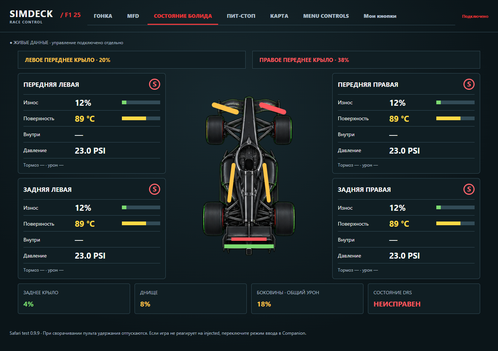
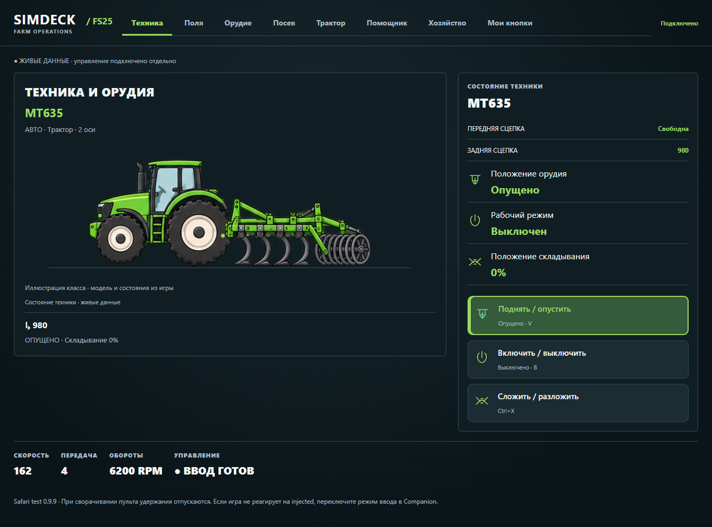
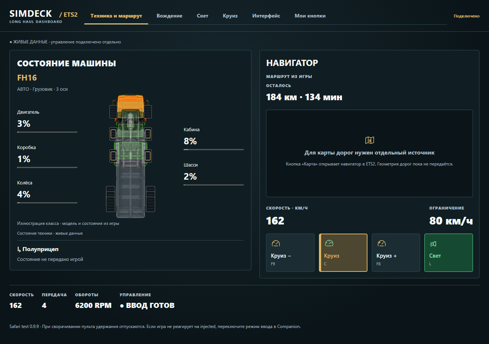
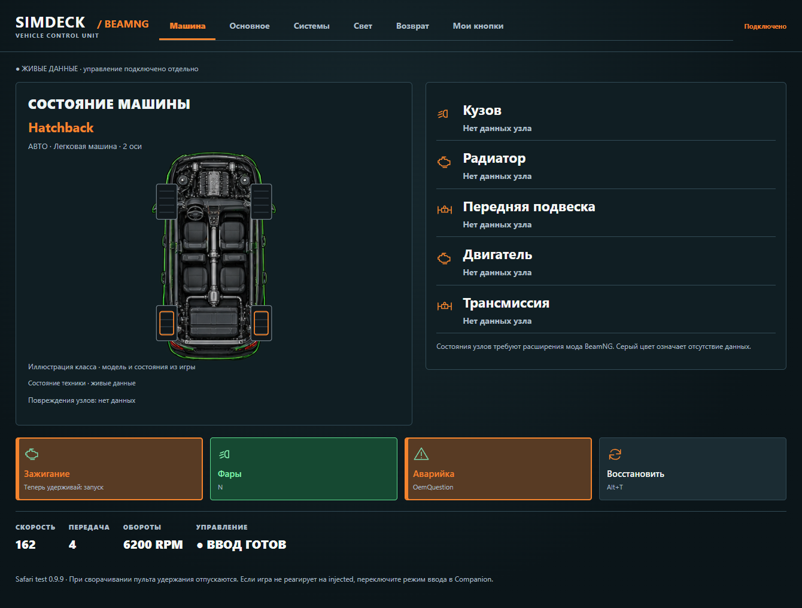
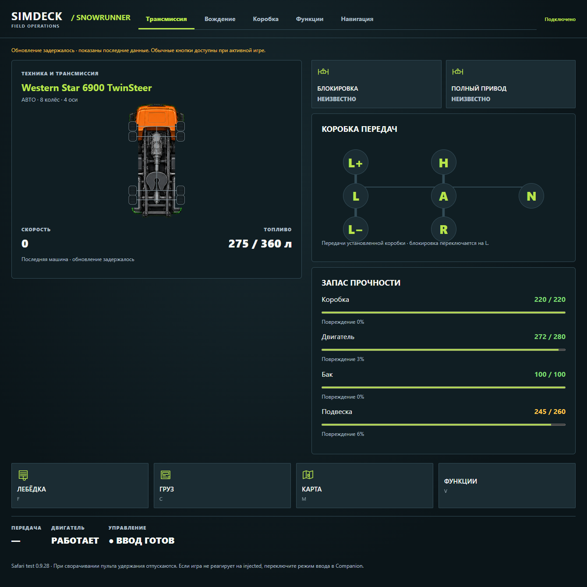
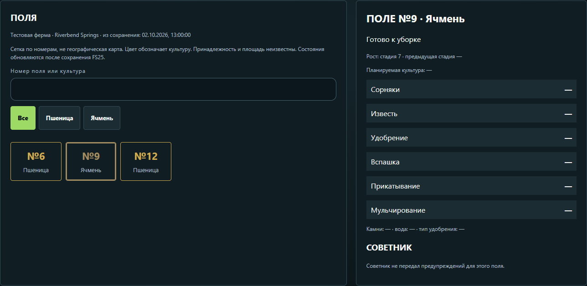
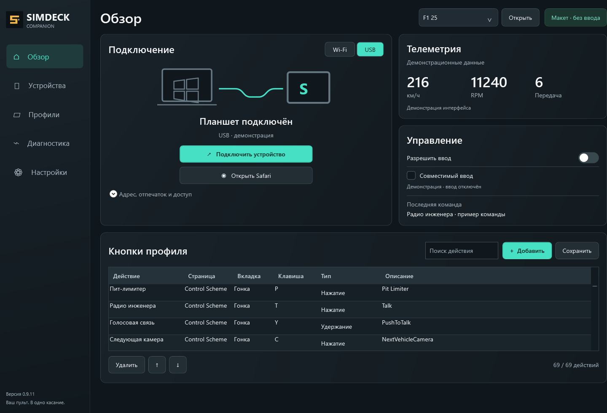
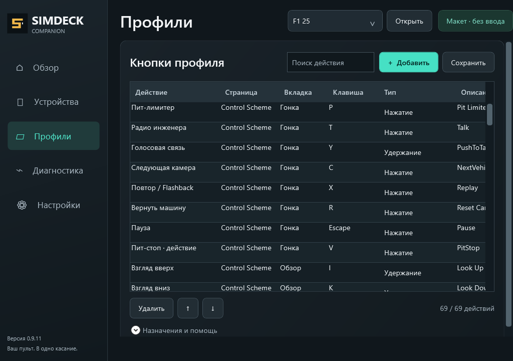
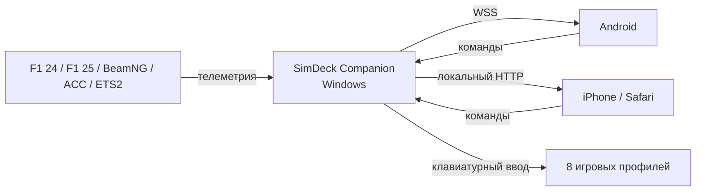

<h1 align="center">SIMDECK</h1>

<p align="center"><strong>Your rig. One touch.</strong></p>

<p align="center">
  
  
  
  
</p>

<p align="center">
  <a href="https://github.com/timurgass/SimDeck/releases/tag/v0.9.11"><strong>Скачать SimDeck 0.9.11</strong></a>
  · <a href="#быстрый-запуск">Быстрый запуск</a>
  · <a href="TROUBLESHOOTING.md">Решение проблем</a>
</p>

SimDeck превращает Android-планшет, телефон или Safari на iPhone в дополнительную панель управления для **F1 24**, **F1 25**, **BeamNG.drive**, **Assetto Corsa Competizione**, **Automobilista 2**, **Euro Truck Simulator 2**, **SnowRunner** и **Farming Simulator 25**. Companion показывает доступную телеметрию и отправляет игровые команды с выбранного устройства.

> [!NOTE]
> Это ранняя тестовая версия. Основные сценарии работают, но проект ещё не достиг версии 1.0.

[Интерфейсы всех профилей и доступные данные](docs/UI-PROFILES-099.md). Показания сохраняются при задержках; клавиатурные команды работают независимо от телеметрии при активном окне игры.

## Скачать

Для любой игры сначала скачайте [Windows Companion](https://github.com/timurgass/SimDeck/releases/download/v0.9.11/SimDeck-0.9.11-Windows.zip) и полностью распакуйте архив. Для Android дополнительно установите [APK](https://github.com/timurgass/SimDeck/releases/download/v0.9.10/SimDeck-0.9.10-Android.apk). На iPhone отдельный файл не нужен: откройте локальный Safari-пульт из Companion. Companion **0.9.11** совместим с APK **0.9.10** и модом FS25 **1.4.0.0**; обновлять их для нового дизайна ПК не требуется. [Изменения и USB](docs/UPDATE-0911.md) · [Контрольная сумма Windows](https://github.com/timurgass/SimDeck/releases/download/v0.9.11/SimDeck-0.9.11-SHA256SUMS.txt).

### Дополнительные файлы по играм

Скачивайте только строку для своей игры. **Мод/плагин** передаёт данные из игры; **пресет** назначает игровые клавиши для кнопок SimDeck. Пресеты не нужны, если вы вручную назначили те же клавиши в игре и Companion.

- **F1 24 / F1 25 — [скачать пресет клавиш](https://github.com/timurgass/SimDeck/releases/download/v0.8.4/SimDeck-F1-Preset-0.7.1.zip).** Он настраивает 69 действий: распакуйте архив, закройте игру, запустите `Install-F1-24.cmd` или `Install-F1-25.cmd` и выберите Keyboard Preset 2. Телеметрия работает через UDP игры, отдельный мод не нужен. [Настройка F1](#3-настройте-игру).
- **BeamNG.drive — [скачать мод телеметрии](https://github.com/timurgass/SimDeck/releases/download/v0.9.10/SimDeck-0.3.0-BeamNG.zip).** Он передаёт передачу, режим коробки и состояния переключателей. Положите ZIP **без распаковки** в пользовательскую папку `mods`, включите мод и перезагрузите машину. Без него остаётся ограниченный резервный OutGauge. [Подробности](beamng/README.md).
- **Assetto Corsa Competizione — [скачать пресет клавиш](https://github.com/timurgass/SimDeck/releases/download/v0.8.4/SimDeck-ACC-Preset-0.8.3.zip).** Он настраивает 33 команды: закройте игру, распакуйте архив и запустите `Install-ACC.cmd`. Телеметрия читается из Shared Memory игры, отдельный мод не нужен. [Подробности](ACC-PROFILE.md).
- **Euro Truck Simulator 2 — [скачать плагин телеметрии](https://github.com/timurgass/SimDeck/releases/download/v0.8.7/SimDeck-ETS2-Telemetry-0.8.5.zip) и [пресет клавиш](https://github.com/timurgass/SimDeck/releases/download/v0.8.7/SimDeck-ETS2-Preset-0.8.7.zip).** Плагин нужен для приборов и маршрута: распакуйте его и запустите `Install-ETS2.cmd` при закрытой игре. Для готовых 29 кнопок отдельно распакуйте пресет и запустите `Install-ETS2-Preset.cmd`. [Подробности](ETS2-PROFILE.md).
- **Farming Simulator 25 — [скачать мод состояния техники](https://github.com/timurgass/SimDeck/releases/download/v0.9.10/FS25_SimDeckStatus.zip).** Он **необязателен для кнопок и данных сохранения**, но нужен для живого статуса орудия, агрегата, двигателя и текущих цен продажи. Положите ZIP **без распаковки** в `Documents/My Games/FarmingSimulator2025/mods` и включите мод для сохранения. [Подробности](mods/FS25_SimDeckStatus/README.md).
- **Automobilista 2 / SnowRunner — дополнительные файлы не нужны.** Кнопки настраиваются вручную в игре и Companion; адаптеры живой телеметрии пока не готовы.

Исходники наших модов есть в репозитории: [BeamNG.drive](beamng/mod/lua/vehicle/protocols/simdeckTelemetry.lua) и [FS25](mods/FS25_SimDeckStatus/SimDeckStatus.lua). Установщики пресетов лежат в `tools/`. DLL телеметрии ETS2 — сторонний компонент с лицензией и исходным проектом, указанными в [описании плагина](tools/ets2-telemetry/README.md); готовая DLL включена в архив для скачивания.

## Возможности

- Живая скорость, RPM, передача, топливо и состояние педалей.
- Температура, давление, износ и состояние тормозов каждого колеса в F1 и ACC.
- Карта трассы, положение машин и порядок пилотов.
- Настройка следующего пит-стопа: переднее крыло, ремонт и состав шин.
- Готовые запросы инженеру и управление игровыми меню.
- Настраиваемые кнопки и сочетания с `Ctrl`, `Alt` и `Shift`.
- Подтверждённые состояния света и переключателей BeamNG.
- Android-клиент и полнофункциональный локальный пульт для Safari.
- Защищённое сопряжение, отзыв доступа и один активный контроллер.
- Два режима Windows-ввода: Scan Code и совместимый Virtual-Key.

## Интерфейс игровых профилей

Android-приложение и Safari-пульт выбирают оформление по активному профилю Companion. Кнопки, телеметрия и состояние подключения остаются теми же; при отсутствии данных приборы показывают прочерк, а не выдуманные значения.

| Профиль | Оформление | Главный экран |
| --- | --- | --- |
| F1 24 | Race Control | Схема болида, шины, крылья, боковины и неисправность DRS |
| F1 25 | Тот же Race Control, что у F1 24 | Общая схема болида; гонка, MFD, инженер, пит-стоп и карта сохраняются |
| BeamNG.drive | Приборная панель автомобиля | Скорость, коробка, свет и кнопки машины |
| ACC | Панель GT | Обороты, скорость и состояние четырёх колёс |
| Automobilista 2 | Кокпит | Приборы при наличии данных и крупные кнопки |
| ETS2 | Панель грузовика | Маршрут, скорость, топливо и управление кабиной |
| SnowRunner | Экспедиционная панель | Кнопки трансмиссии и лебёдки; приборы при наличии данных |
| FS25 | Панель фермы | Сохранение, поля, состояние техники и орудий |

## Поддерживаемые игры

| Игра | Телеметрия | Управление | Особенности |
|---|---|---|---|
| **F1 24** | UDP 2024 | 69 действий | Трассы, пилоты, колёса, повреждения, инженер, пит-стоп |
| **F1 25** | UDP 2025 и совместимый 2024 | 69 действий | Тот же готовый профиль и отдельный процесс `F1_25` |
| **BeamNG.drive** | Мод SimDeck, резервный OutGauge | 22 действия | Реальная передача, режим коробки, свет, привод и возврат машины |
| **Assetto Corsa Competizione** | Shared Memory | 33 действия + готовый пресет | Приборы, четыре колеса, тормоза, двигатель и подтверждённые переключатели |
| **Automobilista 2** | Запланирована Shared Memory | 31 действие | Гонка, электроника, ICM и HUD |
| **Euro Truck Simulator 2** | SCS Telemetry SDK через плагин | 29 действий | Приборы, маршрутные метрики, векторные значки и состояния переключателей |
| **SnowRunner** | Нет подтверждённого штатного потока | 26 действий | Трансмиссия, лебёдка, оборудование и навигация |
| **Farming Simulator 25** | Последнее сохранение XML; живое состояние через дополнительный мод | 54 действия | Значки действий, одна кнопка сцепки, состояние выбранного орудия/молотилки/двигателя при включённом моде |

Подробные назначения: [F1 24](F1-24-PROFILE.md) · [F1 25](F1-25-PROFILE.md) · [BeamNG.drive](BEAMNG-PROFILE.md) · [ACC](ACC-PROFILE.md) · [Automobilista 2](AUTOMOBILISTA-2-PROFILE.md) · [ETS2](ETS2-PROFILE.md) · [SnowRunner](SNOWRUNNER-PROFILE.md) · [Farming Simulator 25](docs/FS25-STATUS.md)

Для FS25 выберите профиль в Companion, нажмите **«Прочитать клавиши FS25»** и укажите игровой `inputBinding.xml`, если меняли назначения. Сохраните ферму: экран Android/Safari покажет состояние последнего сохранения, время записи, предупреждения и загруженный план. Для актуального положения орудия и состояния агрегата установите [дополнительный мод](mods/FS25_SimDeckStatus/README.md) и включите его в сохранении. [Проверка модуля](docs/FS25-TESTING.md) · [Макет будущих экранов](docs/fs25-mockup.html).

Для разработчиков новых игр: [точки интеграции и требования к передаче работы](docs/DEVELOPING-GAMES.md).

## Интерфейс

В Android и Safari используются общие подробные иллюстрации техники: класс машины определяется из доступных игровых данных. Название конкретной модели и состояния показаны отдельно; картинка не является её точной 3D-копией. F1 24 и F1 25 используют один красный дизайн. На телефоне панели располагаются вертикально, на планшете — в колонках.

Ниже — **работающий браузерный клиент 0.9.10 с тестовыми показаниями**. Это экран приложения с встроенными изображениями техники, а не готовая картинка интерфейса. Нет данных — нет выдуманных показаний. [Все восемь профилей и ограничения данных](docs/UI-PROFILES-099.md).

| F1 · шины и крылья | FS25 · техника и орудие |
|---|---|
|  |  |

| ETS2 · подключённый прозрачный прицеп | BeamNG · состояние машины |
|---|---|
|  |  |

| SnowRunner · привод и блокировка | FS25 · поля сохранения |
|---|---|
|  |  |

[Примеры ACC, AMS2 и телефонного режима](docs/UI-PROFILES-099.md#примеры-интерфейса).

В 0.9.10 верхние вкладки сохраняют все настроенные страницы и пользовательские кнопки. Главные экраны повторяют композиции согласованных примеров: крупная схема, состояния справа и основные действия рядом. В FS25 добавлена отдельная вкладка **«Поля»** с выбором и фильтрацией данных сохранения. Состояния приходят из игры; при задержке остаются последние показания с явной отметкой их возраста. Для AMS2 и SnowRunner живая телеметрия пока недоступна. ETS2 передаёт числовые показатели маршрута, а карта дорог ещё не реализована. BeamNG передаёт класс и колёса, но карта повреждений отдельных узлов пока не поступает из мода.

### Windows Companion

#### Подключение и диагностика



#### Редактор профиля



Companion показывает состояние подключения, входящую телеметрию и результат последней команды. Во встроенном редакторе можно менять клавиши, добавлять свои действия и сразу обновлять раскладку подключённого устройства. Снимки получены из реального WPF-интерфейса с обозначенными демонстрационными данными; адресов, кодов и отпечатков пользователя нет. [Новый дизайн Companion и выбор Wi-Fi/USB](docs/UPDATE-0911.md).

## Быстрый запуск

### 1. Запустите Companion

1. Скачайте и полностью распакуйте `SimDeck-0.9.11-Windows.zip`.
2. Запустите `SimDeck.exe`. Переносить один EXE из папки нельзя.
3. Выберите профиль игры и оставьте Companion запущенным.

Запуск от имени администратора обычно не нужен. Игра и Companion должны работать с одинаковыми правами.

### 2. Подключите устройство

**Android**

1. Установите APK.
2. Подключите ПК и устройство к одной домашней сети.
3. В Companion нажмите **«Подключить устройство»**.
4. На Android выберите ПК, сравните все 64 символа отпечатка и введите двухминутный код.

**iPhone / Safari**

1. В Companion нажмите **«Открыть Safari»**.
2. Откройте показанный адрес в Safari в той же сети.
3. Введите код сопряжения.

После перезапуска Companion для Safari требуется новый код. Новое успешное сопряжение отключает ранее подключённый контроллер.

### 3. Настройте игру

<details>
<summary><strong>F1 24 / F1 25</strong></summary>

1. Полностью распакуйте `SimDeck-F1-Preset-0.7.1.zip`.
2. Закройте игру.
3. Запустите `Install-F1-24.cmd` или `Install-F1-25.cmd` из распакованной папки.
4. В игре выберите изменённый **Keyboard Preset 2**.
5. Включите UDP:

| Параметр | Значение |
|---|---|
| UDP Telemetry | On |
| UDP Broadcast Mode | Off |
| UDP IP Address | `127.0.0.1` |
| UDP Port | `20777` |
| UDP Send Rate | `60 Hz` |
| UDP Format | `2024` для F1 24, `2025` для F1 25 |

Установщик создаёт резервную копию и изменяет только Keyboard Preset 2. Полные инструкции: [F1 24](F1-24-PROFILE.md) и [F1 25](F1-25-PROFILE.md).

</details>

<details>
<summary><strong>ACC</strong></summary>

1. Полностью закройте ACC и распакуйте `SimDeck-ACC-Preset-0.8.3.zip`.
2. Запустите `Install-ACC.cmd`: он сохранит резервные копии, добавит клавиши и включит ручное управление двигателем, не меняя руль и педали.
3. Выберите профиль **Assetto Corsa Competizione** в Companion.
4. Запустите ACC и выйдите на трассу. Дополнительные настройки телеметрии не требуются.

На Android и в Safari отображаются скорость, RPM, передача, топливо, давление и температура шин, температура тормозов, температура двигателя и подтверждённые состояния пит-лимитера и зажигания. Кнопка **ЗАЖИГАНИЕ ВЫКЛ** использует проверенную штатную страницу электроники MFD.

</details>

<details>
<summary><strong>Euro Truck Simulator 2</strong></summary>

1. Полностью закройте ETS2 и распакуйте `SimDeck-ETS2-Telemetry-0.8.5.zip`.
2. Запустите `Install-ETS2.cmd` и укажите папку установленной игры. Скрипт проверит DLL, сохранит прежний плагин при необходимости и скопирует новый в `bin/win_x64/plugins`.
3. Запустите ETS2, загрузите грузовик и выберите профиль **Euro Truck Simulator 2** в Companion.
4. Для кнопок включите клавиатурный ввод и вернитесь в игру. Профиль содержит 29 назначений, включая прямой выбор камеры и F8/F9 для круиза. Для F8/F9 установите [два бинда в ETS2](tools/ets2-preset/README.md) после закрытия игры.

При активном грузовике отображаются скорость, RPM, передача, топливо, маршрутные расстояние/время/лимит и состояния переключателей. [Подробнее об установке и назначениях](ETS2-PROFILE.md).

</details>

<details>
<summary><strong>Automobilista 2 / SnowRunner</strong></summary>

1. Выберите профиль игры в Companion.
2. Нажмите **«Открыть профиль»** и посмотрите предложенные клавиши.
3. Назначьте те же клавиши соответствующим действиям в настройках игры.
4. При необходимости измените клавиши в редакторе Companion и сохраните профиль.

Эти два профиля работают как button box. До подключения адаптеров телеметрии значения приборов остаются пустыми.

</details>

<details>
<summary><strong>BeamNG.drive</strong></summary>

1. Скопируйте `SimDeck-0.2.1-BeamNG.zip` в пользовательскую папку BeamNG `mods`. Архив распаковывать не нужно.
2. Убедитесь, что мод включён и игре разрешены сторонние протоколы.
3. Перезагрузите машину через `Ctrl+R` либо загрузите её заново.
4. В Companion выберите BeamNG и UDP-порт `4444`.

Подробности: [установка телеметрии BeamNG](beamng/README.md).

</details>

### 4. Включите управление

1. В Companion включите **«Разрешить ввод»**.
2. Вернитесь в окно игры: команды работают только когда выбранная игра активна.
3. Если Companion показывает `injected`, но игра не реагирует, попробуйте **«Совместимый ввод Virtual-Key»**. Для проверенной установки ETS2 работает обычный Scan Code; оставьте Virtual-Key выключенным, если он не помогает.

Телеметрия и управление работают независимо. Приборы могут обновляться, пока кнопки серые из-за выключенного ввода или неактивного окна игры.

## Как это работает


```mermaid
flowchart LR
    TelemetryGames["F1 24 / F1 25 / BeamNG / ACC / ETS2"] -->|"телеметрия"| PC["SimDeck Companion<br/>Windows"]
    PC -->|"WSS"| Android["Android"]
    PC -->|"локальный HTTP"| Safari["iPhone / Safari"]
    Android -->|"команды"| PC
    Safari -->|"команды"| PC
    PC -->|"клавиатурный ввод"| Games["8 игровых профилей"]
```

Вся связь остаётся внутри локальной сети. Companion не меняет Windows Firewall автоматически. Если Windows запрашивает сетевой доступ, разрешите его только для частной сети.

## Особенности управления BeamNG

- В аркадном режиме коробка отображается как `D / N / R`.
- В реалистичном режиме отображаются `R / N / 1 / 2 / 3…` с реальным числом передач автомобиля.
- Ближний свет подсвечивается зелёным, дальний — синим.
- Переключатели с подтверждённым состоянием остаются визуально нажатыми.
- Зажигание использует строгую последовательность: отдельное короткое нажатие, затем отдельное удержание для запуска двигателя.

## Диагностика

| Симптом | Что проверить |
|---|---|
| Телеметрия есть, кнопки серые | Включите ввод и верните фокус окну игры |
| Команда показывает `injected`, игра не реагирует | Включите режим Virtual-Key |
| F1 не показывает данные | Проверьте UDP `127.0.0.1:20777`, формат и счётчики пакетов в Companion |
| BeamNG не показывает данные | Проверьте мод, порт `4444` и перезагрузите машину через `Ctrl+R` |
| ACC показывает прочерки | Запустите заезд и выйдите на трассу; Companion читает Shared Memory автоматически |
| ACC выполняет другие действия | Закройте игру и установите `SimDeck-ACC-Preset-0.8.3.zip` |
| Android переподключается | Обновите APK и Companion до 0.8.5; проверьте причину на странице подключения |
| ETS2 показывает прочерки | Установите Win64-плагин из архива, перезапустите ETS2 и загрузите грузовик |
| AMS2 / SnowRunner показывают прочерки | Для них пока готово только управление; адаптеры телеметрии ещё не подключены |
| Новый профиль не реагирует на кнопку | Назначьте предложенную клавишу этому действию в самой игре и верните фокус её окну |
| Safari долго загружается | Проверьте одну Wi-Fi-сеть и откройте новый адрес после перезапуска Companion |

Полное руководство: [TROUBLESHOOTING.md](TROUBLESHOOTING.md).

## Документация

- [История изменений](RELEASE-NOTES.md)
- [Результаты проверок](VALIDATION.md)
- [Профиль F1 24](F1-24-PROFILE.md)
- [Профиль F1 25](F1-25-PROFILE.md)
- [Профиль BeamNG.drive](BEAMNG-PROFILE.md)
- [Профиль Assetto Corsa Competizione](ACC-PROFILE.md)
- [Профиль Automobilista 2](AUTOMOBILISTA-2-PROFILE.md)
- [Профиль Euro Truck Simulator 2](ETS2-PROFILE.md)
- [Профиль SnowRunner](SNOWRUNNER-PROFILE.md)
- [Протокол Companion ↔ клиент](protocol/README.md)
- [Телеметрия BeamNG](beamng/README.md)

## Сборка из исходников

<details>
<summary>Требования и команды</summary>

Требуются .NET SDK **10.0.401**, Java 17, Android SDK platform 35 и build-tools 36.0.0. Gradle Wrapper **8.9** находится в `android/`.

```powershell
dotnet build companion/SimDeck.App/SimDeck.App.csproj -c Release
dotnet run --project companion/SimDeck.Tests/SimDeck.Tests.csproj -c Release
dotnet publish companion/SimDeck.App/SimDeck.App.csproj -c Release -r win-x64 --self-contained true -o artifacts/Companion

cd android
.\gradlew.bat testDebugUnitTest assembleDebug
```

Android SDK задаётся через `ANDROID_HOME` или локальный `android/local.properties`. Для отдельного тестового профиля используйте `SimDeck.exe --data-dir <папка>`, для демонстрационных приборов — `SimDeck.exe --demo`.

</details>

## Текущий статус

Companion **0.9.11** использует согласованный графитовый дизайн, навигацию слева, поиск действий и подготовку USB кнопкой на ПК. [Подробнее](docs/UPDATE-0911.md). Версия **0.9.10** добавляет проценты шкал в «Полях», отдельную вкладку текущих цен по культурам и пунктам продажи, заливку повреждённых крыльев/боковин/DRS F1 и переключение сохранённого ПК на USB/ADB. [Подробнее](docs/UPDATE-0910.md). Версия 0.9.9 перенесла крупные схемы и панели согласованного дизайна, добавляет «Поля» FS25 и ускоряет живые состояния. Предыдущие исправления пропорций и отдельная разгрузка на землю (Ctrl+I) сохранены. Сохраняются 92 класса техники и орудий, автоматическое сопоставление 103 категорий магазина и отдельные самоходные/прицепные варианты. Жатка показана с узкого торца и появляется только при подключении. Рисунки и координаты общие для Android и Safari. Все прежние вкладки и пользовательские кнопки сохранены. Для частоты живого состояния 5 Гц нужен мод FS25 **1.4.0.0**; в 0.9.10 появилась отдельная вкладка «Поля». [Изменения](RELEASE-NOTES.md) · [Схемы, установка и ограничения](docs/FS25-EQUIPMENT-096.md) · [Две команды разгрузки FS25](docs/FS25-UNLOADING.md).
