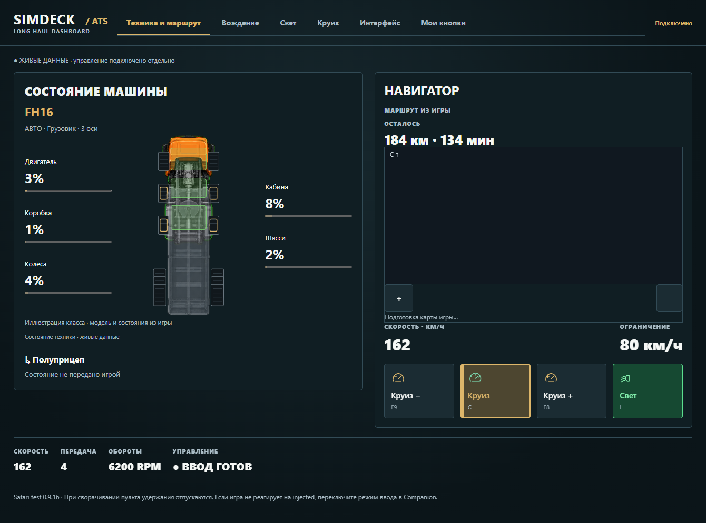
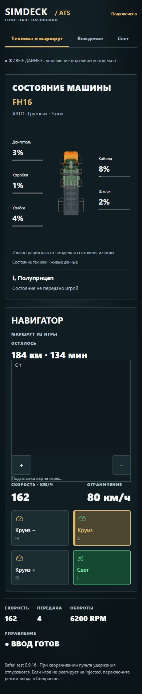

# ATS — обновление 0.9.16

Профиль American Truck Simulator добавлен в Windows Companion, Android Tablet, SimDeck Phone и Safari. Он использует общую с ETS2 панель, 29 действий и SCS-плагин revision 12. Назначения и карта каждой игры хранятся отдельно.

[Скачать, установить DLL и пресет](../ATS-PROFILE.md).

## Проверено

- Тесты Companion: принятие ATS game ID 2, отказ от телеметрии другой игры, независимые назначения, миграция старых настроек, отдельные кэши карт и прежние сценарии.
- Оба Android-варианта собраны; тесты навигации проверяют все девять профилей и соответствие быстрых кнопок присланным действиям.
- Браузерные проверки Chromium и WebKit: девять профилей, пять размеров экрана, все настроенные и пользовательские действия, удержание/отпускание, блокировка ввода и задержанные данные.
- Установщики: 29 назначений на синтетических `controls.sii`, сохранение руля и посторонних кнопок, точная резервная копия, отсутствие изменений при предварительном просмотре и повторной установке. Плагин проверен в отдельной тестовой папке ATS.
- Импорт установленной ATS 1.61.3.1: 29 369 дорожных участков и 50 городов. Плагин установлен; игровое сообщение загрузки DLL подтверждено. Сверка положения грузовика с дорогами ещё требуется после начала карьеры.

Эти проверки подтверждают обработку формата и интерфейсы; они не означают, что все 29 действий уже проверены на реальном грузовике. Живую телеметрию, комплектацию тягача и соответствие клавиш нужно проверить после запуска карьеры с установленным плагином.

## Ограничения

Общий с ETS2 рисунок показывает класс машины, число колёс и прицеп, а не точную модель капотного тягача. Единицы пока метрические. Карта поддерживает форматы игры 1.59–1.61 и показывает дороги и позицию; SDK не предоставляет линию выбранного игрового GPS-маршрута. Пневмосигнал, ретардер и подъём оси требуют соответствующей комплектации. Не запускайте ATS и ETS2 одновременно: плагин использует общее имя разделяемой памяти.

Снимки ниже получены из настоящего браузерного клиента **с тестовыми данными**, без подключения к личной игре и без IP/кодов сопряжения.

