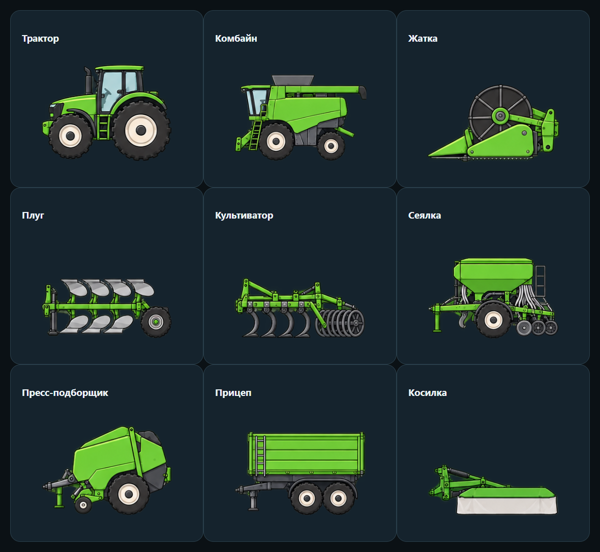

# FS25: единый стиль техники · SimDeck 0.9.6

Техника и орудия используют согласованные плоские схемы сбоку. Жатка показана с узкого торца: мотовило выглядит кругом. Размеры моделей внутри класса унифицированы; изображение не копирует конкретный бренд или комплектацию.

## Что добавлено

92 класса иллюстраций охватывают тракторы, комбайны, грузовики, погрузчики, посев, обработку почвы, уборку урожая, кормозаготовку, прицепы, животноводство, лесную технику и ручные инструменты. Для всех 103 категорий, найденных в локальных метаданных установленной FS25, есть сопоставление. Близкие категории могут использовать одну схему. Это покрытие классификации, а не проверка каждой модели, DLC или стороннего мода в игре.

Мод 1.3.0.0 получает категорию через `g_storeManager:getItemByXMLFilename(...).categoryNames`, затем уточняет возможности и технический тип. Поэтому грузовик или погрузчик с техническим типом `tractor` больше не выбирает автоматически картинку трактора. Самоходные и прицепные варианты косилок, кормосмесителей, аппликаторов, опрыскивателей и уборочной техники различаются. Неизвестный класс остаётся неизвестным; название и переданные состояния при этом доступны.

Комбайн нарисован без жатки. У погрузчиков основная схема без ковша. Подключённые орудия берутся из текущей цепочки сцепки, отсоединённые удаляются. Первое определённое орудие с известным местом крепления рисуется рядом с машиной и анимируется при поднятии/опускании; остальные показываются отдельными схемами и строками состояния ниже. Механическая анимация каждого шарнира и точная геометрия всей сцепки не реализованы. Фаза складывания передаётся процентом; рисунок не выдаётся за точное положение всех частей орудия.

## Обновление

Обновите Windows Companion и Android до **0.9.6**. Safari получает изображения из Companion автоматически. Полностью закройте FS25 и замените [FS25_SimDeckStatus.zip](https://github.com/timurgass/SimDeck/releases/download/v0.9.6/FS25_SimDeckStatus.zip) в `Documents/My Games/FarmingSimulator2025/mods` **без распаковки**. Включите мод для сохранения. [Подробная установка](../mods/FS25_SimDeckStatus/README.md).

## Для разработчиков

- Источник классификации, подписей и координат рисунков: [assets/fs25-equipment.json](../assets/fs25-equipment.json).
- `python tools/qa/generate-fs25-registry.py` создаёт реестры C#, Kotlin, JavaScript и Lua из одного файла. Меняйте исходный JSON и перегенерируйте выходные файлы, чтобы Android и Safari не расходились.
- Новые изображения: `assets/vehicles/fs25-flat-1.png` … `fs25-flat-6.png`. Исходные PNG сохраняют alpha; клиенты выбирают прямоугольники во время отрисовки.
- Список разрешённых файлов обновляется в `BrowserHost.cs` и локальном `serve-dashboard.py`. Чужие пути и имена из телеметрии не используются для загрузки файлов.
- `check-vehicle-mods.py` выполняет настоящий Lua-мод с фикстурами StoreManager, проверяет все 103 категории, уточнения инструментов, самоходные/прицепные варианты, ручной инструмент, смену машины и выход.
- `check-fs25-catalog.cjs` отрисовывает все 92 класса настоящими браузерными функциями, проверяет общий источник, координаты и отсутствие горизонтального переполнения.
- Проверка передачи новых классов есть в .NET и Android. Общая экранная проверка сохраняет все настроенные и пользовательские страницы восьми игровых профилей.

В этой версии не менялись назначения клавиш и транспортный протокол. Сохранения не редактируются. Карта дорог ETS2, повреждения отдельных деталей BeamNG и живая телеметрия SnowRunner/AMS2 остаются отдельными задачами.

## Источники и границы проверки

Каталог типов сверялся с [каталогом FS25](https://farmingsimulator.wiki.gg/wiki/All_Equipment/Farming_Simulator_25) и локальными XML-метаданными игры. API категорий взят из [официальной документации GIANTS StoreManager](https://gdn.giants-software.com/documentation_scripting_fs25.php?category=75&class=609&version=engine). В репозиторий не скопированы игровые XML, текстуры или изображения производителей.

Автоматические проверки охватывают классификацию и отображение. Они не заменяют живую проверку конкретной машины, особенно с модами и DLC.
