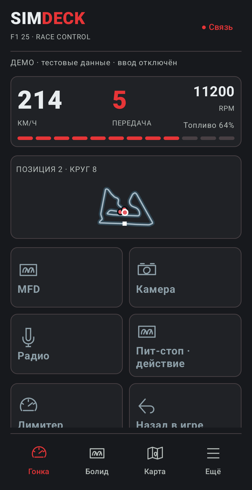
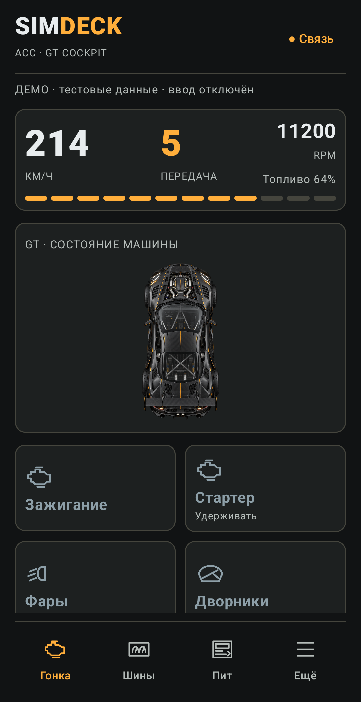
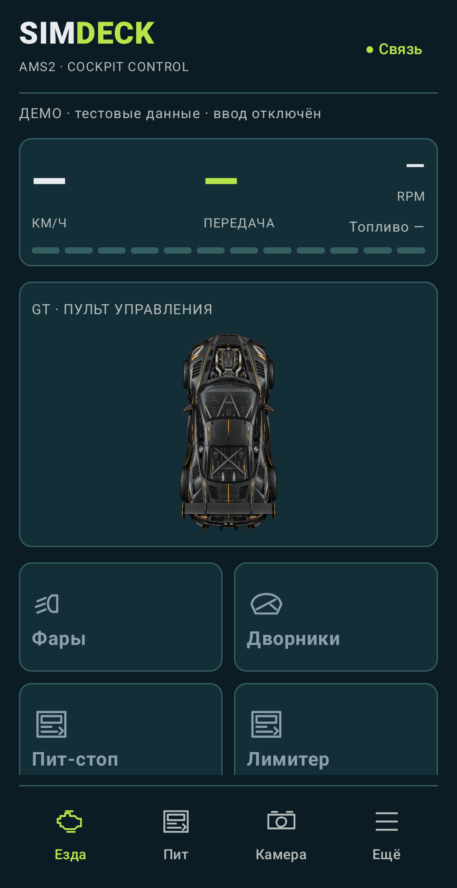
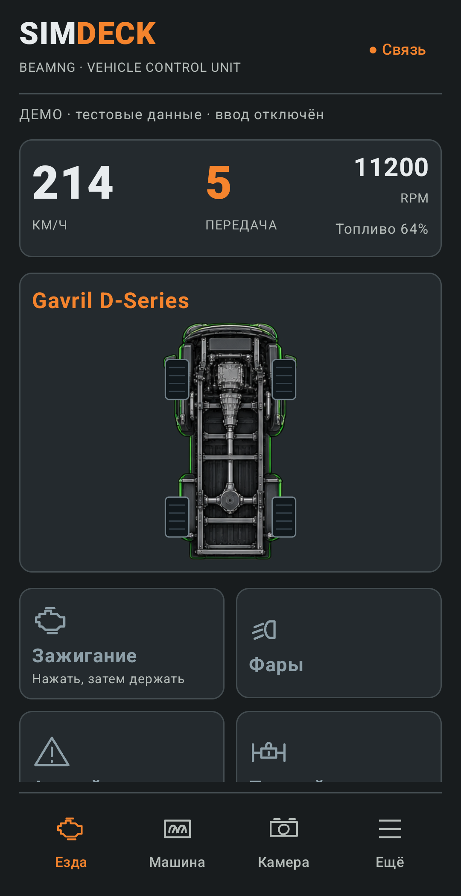
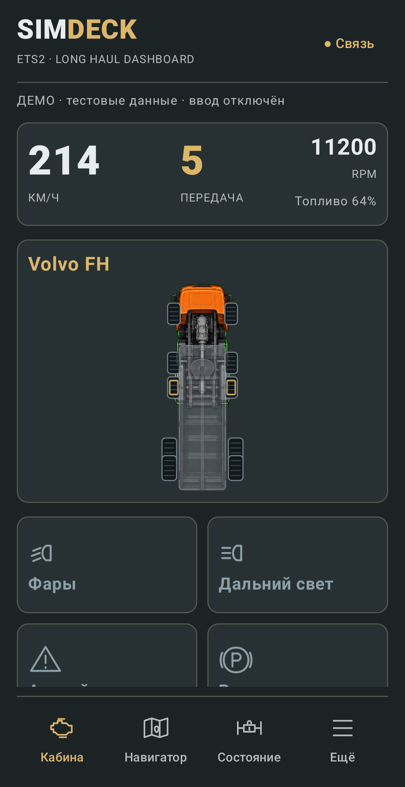
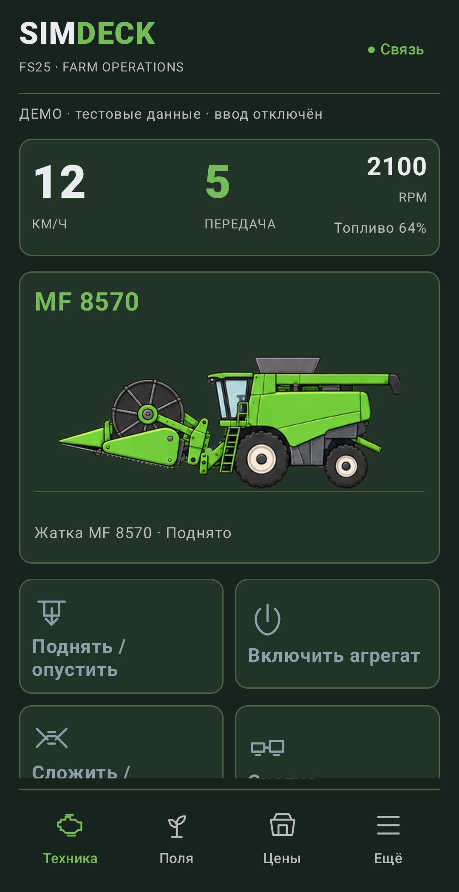
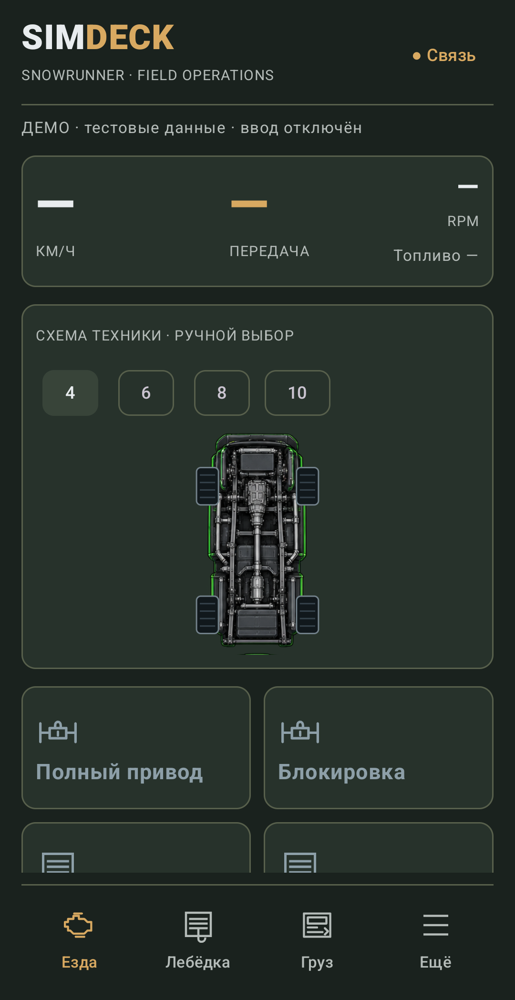
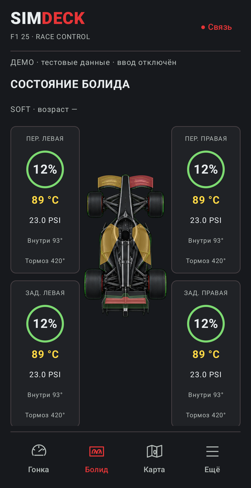
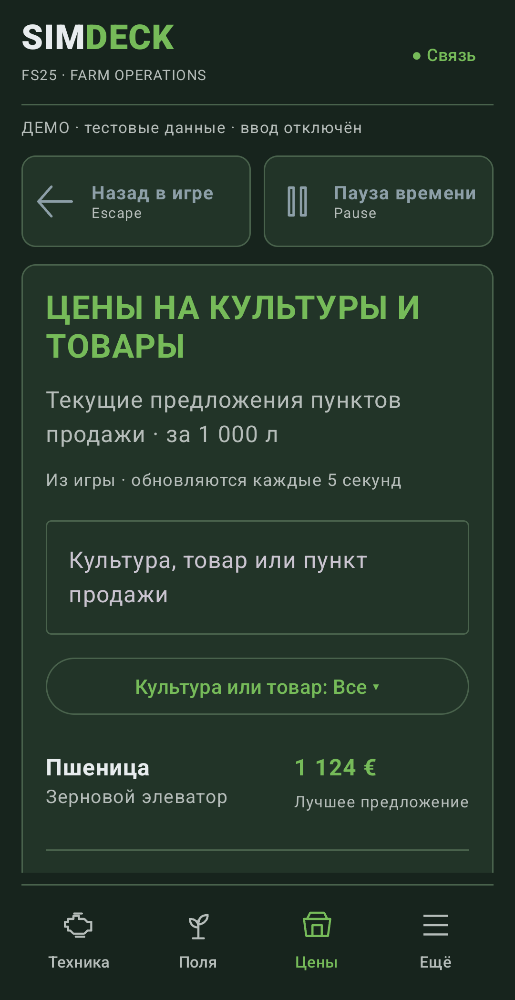

# SimDeck Phone 0.9.15

Отдельный Android-клиент для смартфона. Восемь профилей используют те же рисунки машин, орудий, прицепов и зоны повреждений, что планшет. Телефонная композиция рассчитана на вертикальный экран: приборы компактнее, действия расположены в двух колонках, четыре раздела навигации закреплены снизу. При повороте содержимое прокручивается, навигация остаётся доступной.

## Что скачать

| Устройство | Файл |
| --- | --- |
| Android-телефон, Android 10+ | [SimDeck-0.9.15-Phone.apk](https://github.com/timurgass/SimDeck/releases/download/v0.9.15/SimDeck-0.9.15-Phone.apk) |
| Android-планшет, Android 10+ | [SimDeck-0.9.15-Android.apk](https://github.com/timurgass/SimDeck/releases/download/v0.9.15/SimDeck-0.9.15-Android.apk) |
| Windows 10/11 | [Companion 0.9.14](https://github.com/timurgass/SimDeck/releases/download/v0.9.14/SimDeck-0.9.14-Windows.zip) — совместим с обоими APK |
| iPhone | Safari из Companion; APK на iPhone не устанавливается |

Phone устанавливается как **SimDeck Phone** (`dev.simdeck.phone`), рядом с **SimDeck** (`dev.simdeck`). У него отдельное сохранённое сопряжение. Удалять прежнее приложение не нужно. Планшетный APK обновляет прежний SimDeck. Новые игровые моды и пресеты для этого выпуска не нужны; FS25 использует мод 1.5.0.0.

1. Установите Phone APK и откройте SimDeck Phone.
2. В Companion выберите нужный профиль игры и нажмите «Подключить планшет» (кнопка подходит также для телефона).
3. На телефоне выберите ПК, сравните отпечаток, подтвердите совпадение и введите код.
4. Откройте игру на ПК. Кнопки становятся доступны, когда Companion подтверждает готовность ввода. Телеметрия и клавиатурные команды независимы: задержка показаний не блокирует обычные действия.
5. Для USB после первого сопряжения используйте «USB · сохранённый ПК» и подготовку ADB в Companion. Wi-Fi остаётся альтернативой.

Один Companion принимает один активный пульт: при переходе с планшета на телефон предыдущий пульт уступает управление. Установка Phone сама по себе не меняет сопряжение планшета.

## Разделы

| Профиль | Нижняя навигация |
| --- | --- |
| F1 24 / F1 25 | Гонка · Болид · Карта · Ещё |
| ACC | Гонка · Шины · Пит · Ещё |
| Automobilista 2 | Езда · Пит · Камера · Ещё |
| BeamNG.drive | Езда · Машина · Камера · Ещё |
| ETS2 | Кабина · Навигатор · Состояние · Ещё |
| SnowRunner | Езда · Лебёдка · Груз · Ещё |
| FS25 | Техника · Поля · Цены · Ещё |

В «Ещё» находятся **все страницы полученного профиля**, включая пользовательские. У F1 отдельно доступны настройка пит-стопа и запросы инженеру; у FS25 — хозяйство/план и прежние группы действий. «Назад» Android возвращает к главным кнопкам; «Назад в игре» отправляет игровую команду. Это разные действия.

Повреждения крыльев, боковин и DRS F1 окрашиваются теми же масками, что на планшете. Шины в центре экрана сопровождают болид с четырёх сторон. FS25 отображает только реально подключённые орудия, с прежними пропорциями и анимацией подъёма. ETS2 показывает прозрачный подключённый прицеп. Поиск и алфавит в полях/ценах сохранены.

## Границы данных

Макеты не расширяют возможности игровых API. AMS2 и SnowRunner пока являются пультами без живых приборов. Схема SnowRunner выбирается вручную; выбор точки троса остаётся в игре. ETS2 показывает дороги и положение грузовика, без линии активного GPS-маршрута. Неизвестный урон или состояние переключателя отображается прочерком, а не выдуманным «выключено». Быстрые кнопки берут реальные назначения из Companion; в заводском F1-профиле нет отдельных действий DRS/обгона, поэтому вместо неподтверждённых биндов доступны MFD и камера. Свои действия можно добавить через редактор Companion.

## Экраны с телефона

Это снимки реального Compose-интерфейса на Samsung Galaxy S21 FE, а не концепты. Системные панели исключены при захвате приложения. Использованы явно обозначенные тестовые данные; ввод отключён. В обычном подключении доступность и состояния кнопок подтверждает Companion. Ни адрес ПК, ни код сопряжения в снимки не включены.

| F1 24 | F1 25 |
| --- | --- |
|  |  |

| ACC | Automobilista 2 |
| --- | --- |
|  |  |

| BeamNG.drive | ETS2 |
| --- | --- |
|  |  |

| FS25 | SnowRunner |
| --- | --- |
|  |  |

| Повреждения F1 | Цены FS25 |
| --- | --- |
|  |  |

## Сборка и QA

Проверено 04.10.2026: по 73 unit-теста в Phone и Tablet, без ошибок. На Samsung Galaxy S21 FE получены и проверены 40 снимков (четыре раздела × восемь профилей в вертикальном виде, восемь главных экранов в горизонтальном). Во всех восьми профилях проверены открытие «Ещё» касанием и возврат Android Back. Исправлены выход рисунка болида за узкую колонку и обрезание интерфейса вырезом экрана при повороте. Все 11 PNG-ресурсов планшетной графики совпадают побайтно с 0.9.14; подпись обоих APK также сохранена. Это проверка интерфейса и клиентской логики на тестовых данных; игровые бинды каждого установленного симулятора требуют отдельного выезда.

В `android/`: `./gradlew testTabletDebugUnitTest testPhoneDebugUnitTest assembleTabletDebug assemblePhoneDebug`. Выходные файлы: `app/build/outputs/apk/phone/debug/app-phone-debug.apk` и `app/build/outputs/apk/tablet/debug/app-tablet-debug.apk`.

Для локально распространяемых обновлений задайте `SIMDECK_DEBUG_KEYSTORE` путём к прежнему ключу подписи **вне репозитория**. Без переменной используется стандартный debug key SDK; его нельзя считать подписью ранее опубликованных APK. Ключи не входят в релиз.

В debug-сборке QA запускается явно: `adb shell am start -n dev.simdeck.phone/dev.simdeck.MainActivity --es preview_profile f1-25 --es preview_tab condition --es preview_capture f1-25-condition`. Это тестовые показания, ввод отключён, сетевое сопряжение не запускается и не изменяется. Снимок только содержимого приложения сохраняется в его внешней папке `files/phone-preview`. Для обычного запуска завершите тестовый процесс и откройте приложение без extras. Фикстуры не доказывают работу биндов в установленной игре.
