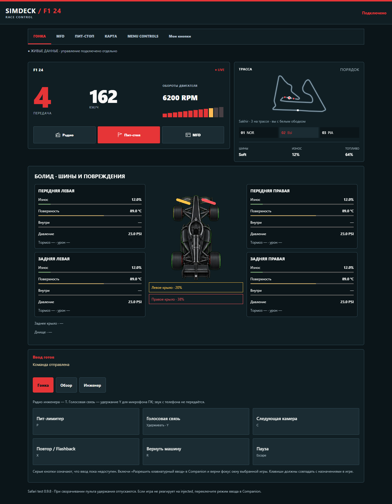
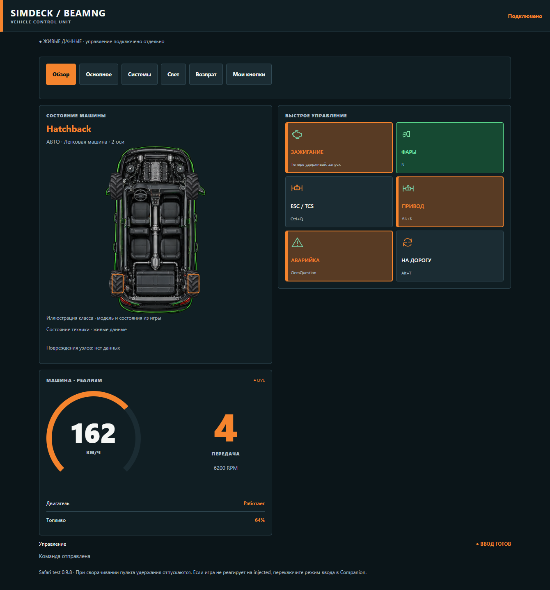
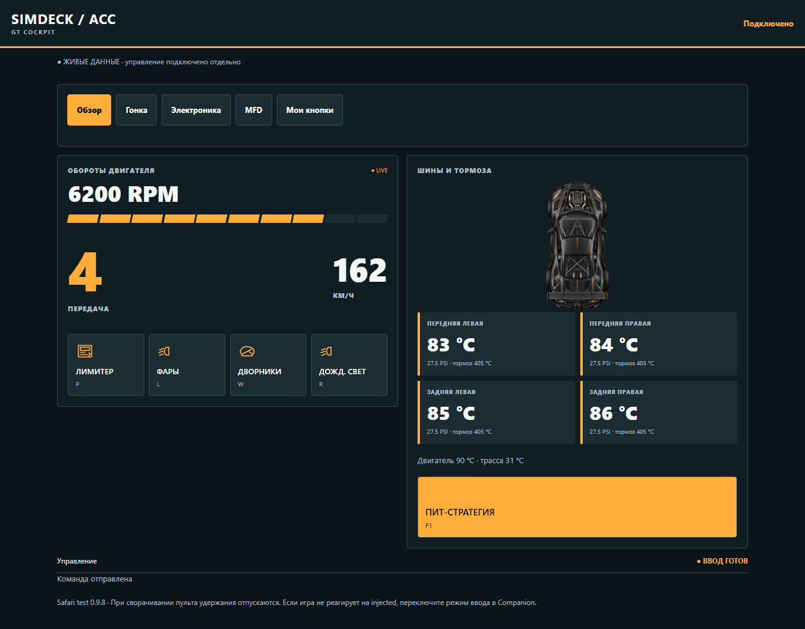
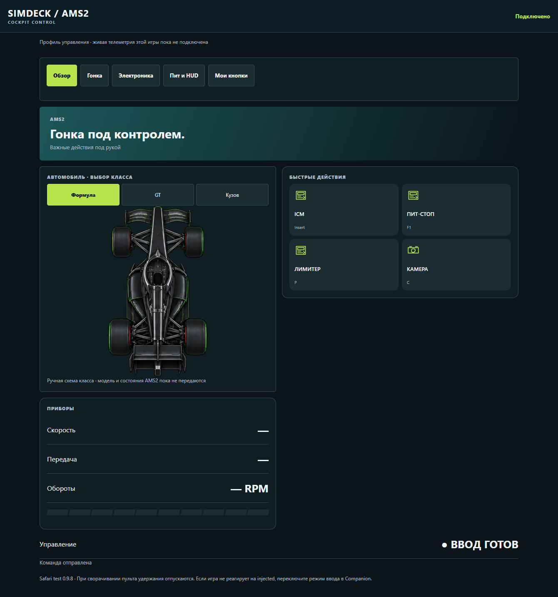
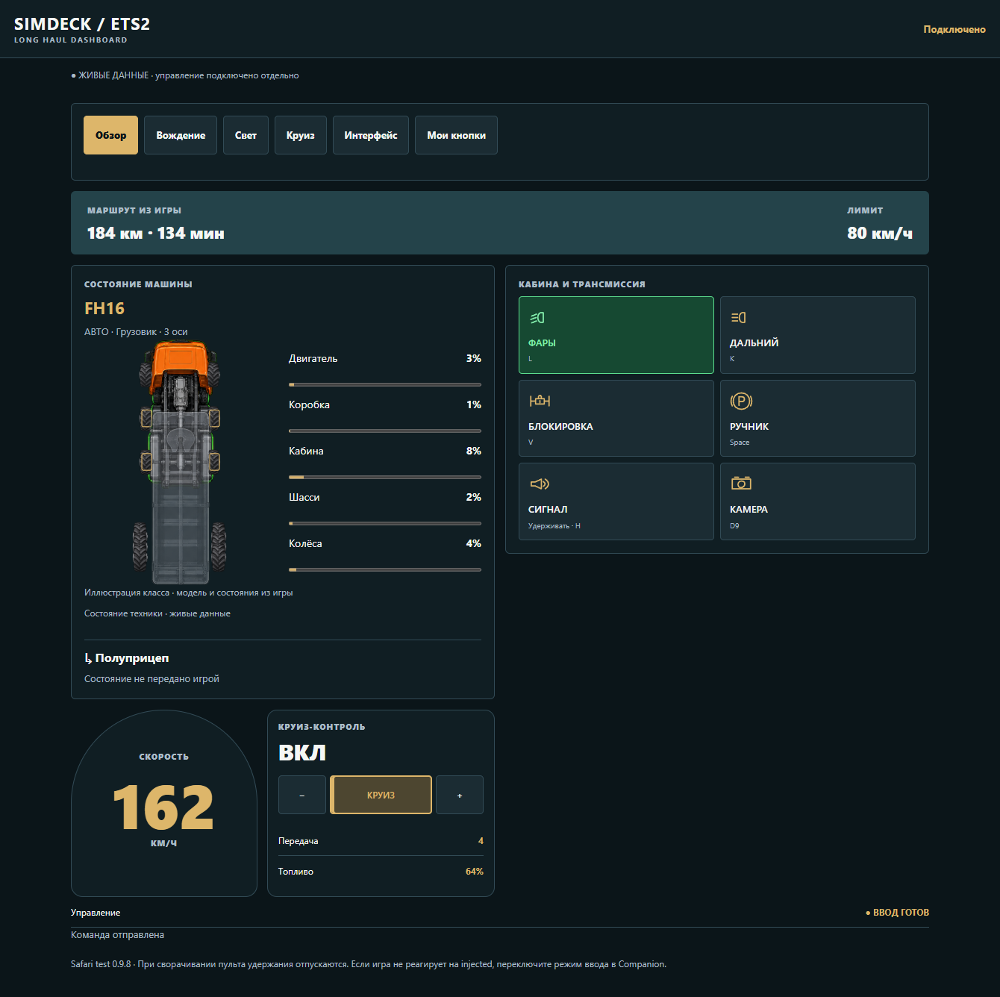
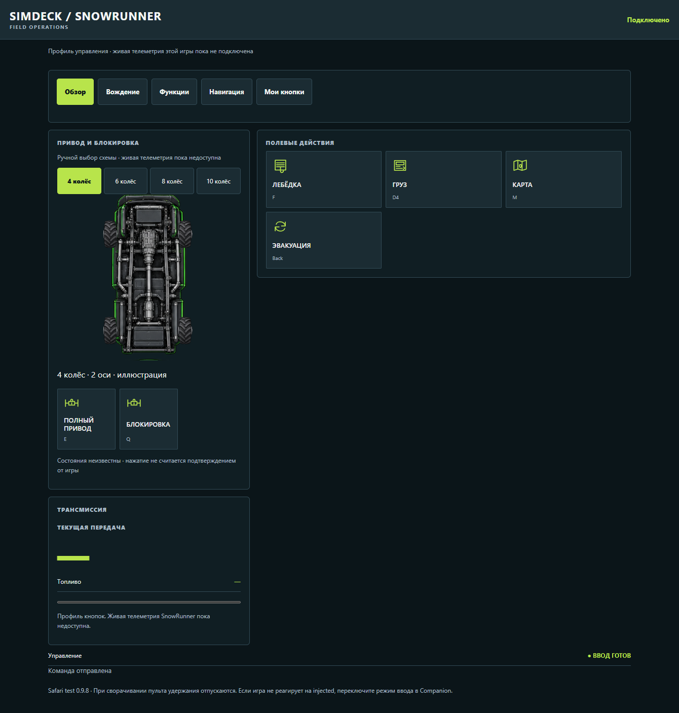
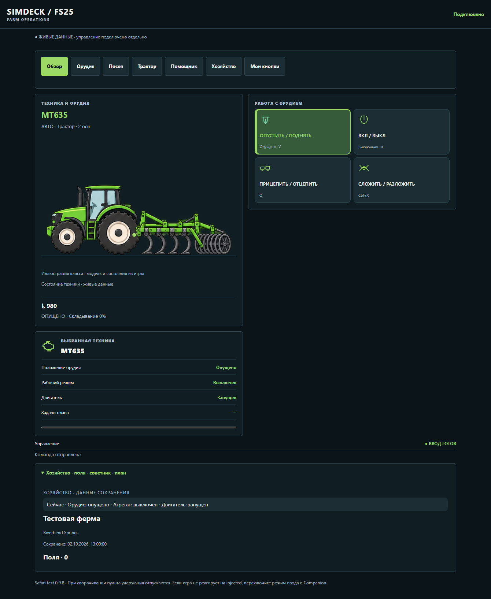

# Интерфейсы профилей 0.9.8

Android и Safari используют общие рисунки техники, цвета профиля и назначенные пользователем действия. На широком планшете основные панели стоят рядом; на телефоне те же панели располагаются вертикально. Вкладки со всеми действиями и пользовательскими кнопками остаются доступны.

| Профиль | Обзор техники и действий | Источник и пределы данных |
|---|---|---|
| F1 24 / F1 25 | Один дизайн для обеих игр. Болид с четырьмя шинами, износом, температурой, давлением и крыльями на экране гонки; MFD, инженер, пит-стоп, карта и пилоты | UDP игры. Значения появляются только при наличии соответствующих пакетов |
| BeamNG.drive | Автоматический класс кузова, геометрия колёс, приборы и быстрые действия | Мод SimDeck. Полная карта повреждённых балок/деталей пока не передаётся |
| ACC | Приборы, GT с параметрами шин и тормозов, лимитер/свет/дворники, пит-стратегия | Shared Memory; схема иллюстрирует класс GT |
| Automobilista 2 | Выбор схемы Формула/GT/Кузов, ICM, пит-запрос, лимитер, камера; все вкладки пресета | Кнопочный профиль. Автоматическое определение машины и живая телеметрия пока не подключены |
| ETS2 | Тягач с прозрачным подключённым прицепом, колёса, доступный износ, круиз и маршрутные показания | SCS Telemetry. SDK даёт расстояние/время/лимит, не изображение навигатора или сеть дорог |
| SnowRunner | Выбор 4/6/8/10 колёс; отдельный элемент полного привода и блокировки; лебёдка, груз, карта, эвакуация | Кнопочный профиль. Состояния неизвестны без игрового источника; их нельзя считать включёнными по нажатию |
| FS25 | Автоматическая техника и реальные присоединённые орудия; плоские схемы сбоку; ферма, поля, советник и план | Живой мод 1.3.0.0 для техники, сохранение для хозяйства |

## Почему показания могут задержаться

Игра производит данные в своём цикле. FS25 пишет файл раз в 400 мс игрового времени, Companion читает его раз в 250 мс. Пауза или остановка игрового обновления останавливают источник. Сеть и интерфейс также получают кадры не одновременно. Нельзя выдавать повторно прочитанный старый кадр за новый.

В 0.9.8 последнее достоверное значение остаётся на экране. Отметка «Обновление задержалось» отделена от связи и ввода. Обновление сохранения FS25 не заменяет возраст живого состояния техники. Возобновление игрового источника обновляет те же панели автоматически.

Обычные кнопки не требуют телеметрии. Нужны подключённый пульт, разрешённый ввод, активное окно выбранной игры и отсутствие другой выполняемой последовательности. При потере соединения кнопки отключаются, удержания отпускаются. Автоматические шаги MFD и запросы инженеру требуют свежих данных о подходящем игровом экране, чтобы не отправлять последовательность вслепую.

## Проверка

Все восемь профилей проверяются в Chromium и WebKit на телефоне, горизонтальном телефоне и планшете: наличие схем, вкладок, пользовательских действий, нажатий и удержаний; сохранение показаний и доступность обычных кнопок при задержке; блокировка при отключённом вводе/связи. Android использует те же материалы и компоненты Compose; APK проходит сборку и тесты.

Живой замер FS25 03.10.2026: 73 обновления за 30 секунд, максимальный промежуток 445 мс, без устаревших и частично прочитанных файлов. Проверки с синтетическими данными не являются утверждением о проверке каждой игры на трассе/карте.

## Снимки работающего интерфейса

Снимки браузерного клиента 0.9.8 сделаны с синтетическими данными. Они показывают реальные компоненты приложения; персональные адреса и системные панели не включены. Для AMS2 и SnowRunner показания не подставляются, потому что их живые источники пока не подключены.

### F1 24

### F1 25

### BeamNG.drive

### ACC

### Automobilista 2

### ETS2

### SnowRunner

### FS25

