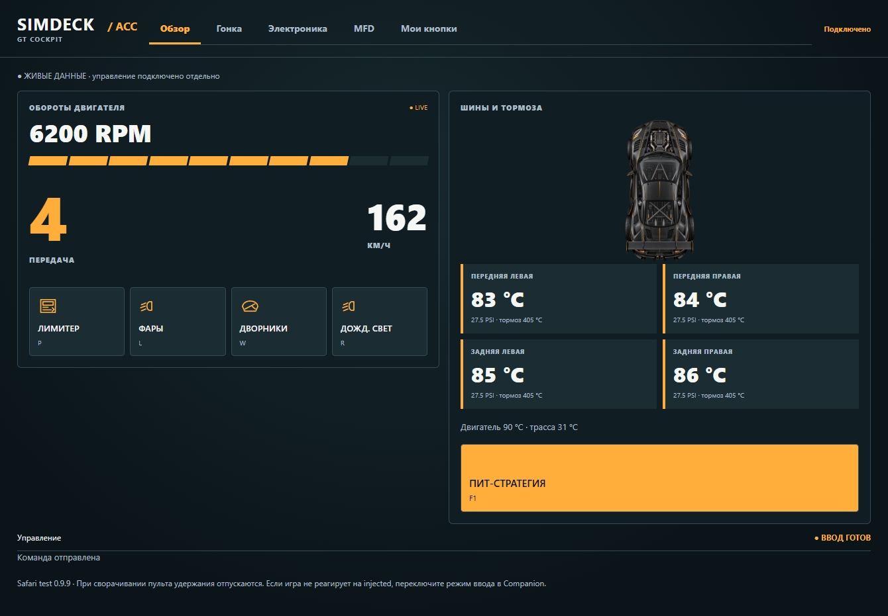
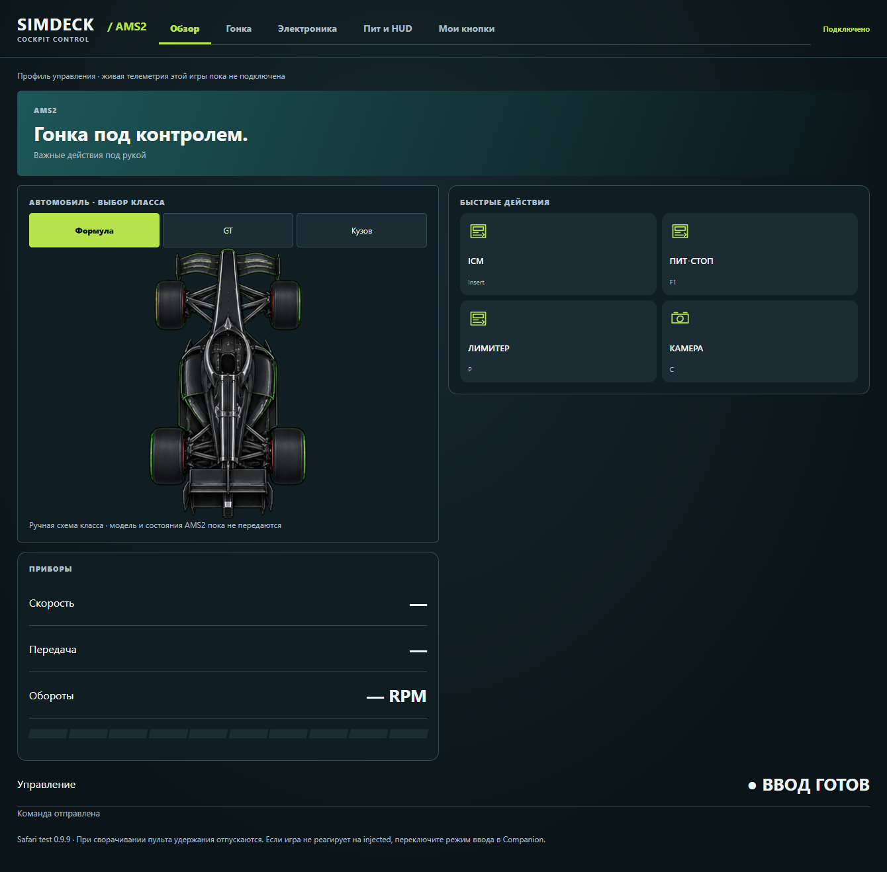
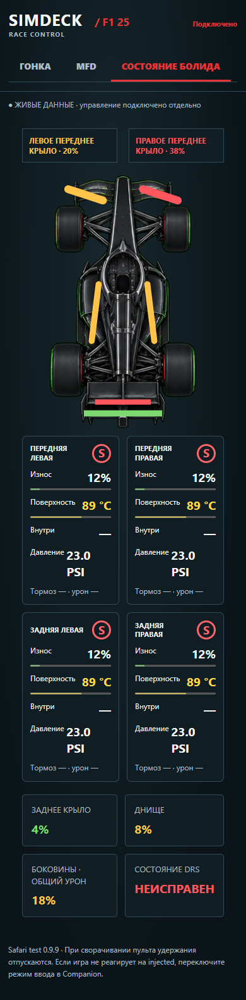
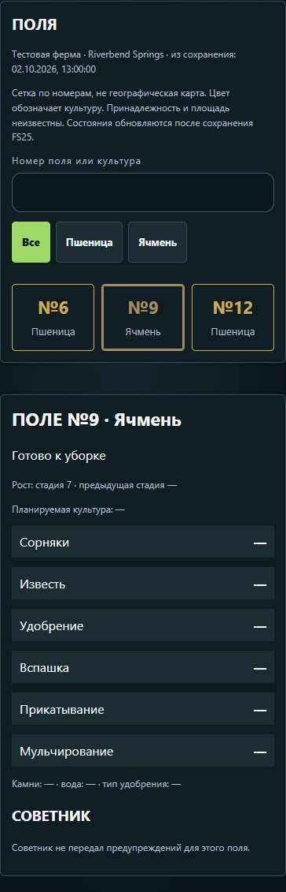

# Интерфейсы SimDeck (обновлено для 0.9.28)

Android и Safari используют композиции согласованных примеров: тёмный фон, тонкие границы, цвет профиля, верхние вкладки, крупную схему техники и состояния рядом с ней. Альбомный режим показывает колонки; на телефоне они располагаются друг под другом. Вкладки с прежними и пользовательскими действиями остаются доступны.

| Профиль | Экран | Источник и ограничения |
|---|---|---|
| F1 24 / F1 25 | «Состояние болида»: большая схема, четыре карточки шин, передние и заднее крылья, днище, боковины, неисправность DRS | UDP игры. `sidepodDamage` — общий урон боковин; раздельного процента слева/справа нет. `drsFault` — неисправность, а не факт открытия DRS. |
| FS25 | «Техника»: схема машины и подключённых орудий слева, сцепки и состояния справа, основные кнопки под ними | Мод 1.3.1.0; модель/класс/колёса/цепочка сцепки. Сохраняются плоские схемы сбоку и жатка с узкого торца. Процент складывания — положение анимации, без предположения о её направлении. |
| ETS2 / ATS | Общий навигатор: дороги, объекты, поиск, маршрут и остановки; состояние тягача и прозрачного прицепа раскрывается отдельной кнопкой | SDK передаёт положение и показания. Карта и направленная дорожная сеть извлекаются локально. Маршрут строится SimDeck отдельно от GPS игры. [Установка и ограничения](TRUCK-NAVIGATOR.md). |
| BeamNG | Большая схема текущего класса машины, список узлов справа, быстрые кнопки снизу | Мод 0.4.0 определяет класс и геометрию колёс. Вкладки «Кузов», «Колёса», «Узлы», «Детали» показывают шесть зон повреждений, спущенные/сломанные колёса, тормоза, неисправности двигателя/коробки и до восьми повреждённых деталей. Цвет наносится на силуэт. Неизвестные состояния показаны прочерками. |
| SnowRunner | Автоматическая схема осей, AWD и блокировка, топливо, скорость и прочность узлов; 23 действия | С 0.9.28: чтение 5 раз/с для проверенной сборки. Ручная схема при отсутствии данных; RPM и передача пока неизвестны. [Настройка](../SNOWRUNNER-PROFILE.md). |
| ACC | Приборы GT и четыре колеса | Доступная телеметрия ACC. |
| AMS2 | Кокпит и выбор класса схемы | Профиль клавиатурного управления; живая телеметрия не подключена. |

Рисунки показывают класс техники, а не точную модель производителя. Отсоединённая жатка или отсутствующий прицеп не дорисовываются. При задержке сохраняются последние показания с соответствующей отметкой. Обычные кнопки зависят от подключения и разрешённого ввода, а не от таймера телеметрии.

## Поля FS25

Вкладка **«Поля»** содержит реальные записи `fields.xml` выбранного сохранения: сетку номеров, поиск по номеру и названию культуры, фильтр культуры и карточку выбранного поля. Доступны стадии роста, состояние грунта, сорняки, известь, удобрение, вспашка, прикатывание, мульчирование, камни, вода и рекомендации советника для этого поля.

Цвет обозначает культуру. Это **сетка по номерам, не географическая карта**. Контуры, площадь и принадлежность участков в текущем источнике отсутствуют. Пустой `fields.xml` не означает отсутствие полей на карте. Эти данные изменяются после сохранения FS25; Companion проверяет сохранение раз в секунду. Файлы сохранений не редактируются.

## Частота живых состояний FS25

Мод 1.3.1.0 записывает состояние каждые 200 мс игрового времени вместо 400 мс. Companion проверяет появление новой записи каждые 50 мс, пропускает неизменившийся файл и отправляет новое состояние на ближайшем 100-миллисекундном такте. При отсутствии изменений остаётся секундный heartbeat. Возраст рассчитывается от фактической записи файла: старый файл не становится свежим от повторного чтения.

Это уменьшает ожидание новых показаний, но не является гарантией сетевого ping. Пауза, нагрузка игры и Wi-Fi могут увеличить задержку. Сохранённые поля и живое состояние орудия имеют разные источники и частоты.

Обновляйте Companion и APK вместе. Для новой частоты требуется заменить ZIP мода, полностью перезапустить FS25 и включить мод в сохранении. [Установка мода](../mods/FS25_SimDeckStatus/README.md).

## Примеры интерфейса

Снимки работающего Safari-клиента с тестовыми данными, без системных панелей. Это проверка размещения элементов; наличие телеметрии конкретного узла определяется источником в таблице выше.

| ACC | Automobilista 2 |
|---|---|
|  |  |

| F1 на телефоне | Поля FS25 на телефоне |
|---|---|
|  |  |

## Навигатор 0.9.18

Один визуал используется в Android Tablet, Android Phone и Safari. Ниже — работающий браузерный клиент с настоящей импортированной картой ATS и тестовым потоком показаний. Это не изображение, сгенерированное для концепта. На Android также проверены загрузка карты и маршрут из текущего положения грузовика.

