# Интерфейс техники · SimDeck 0.9.4

Упрощённые прямоугольные схемы заменены подробными изображениями классов. Android и Safari используют одни встроенные PNG: [ресурсы и описание генерации](../assets/vehicles/README.md). Название, колёса и доступные состояния берутся из игры; картинка не является точной моделью.

## Что проверено

- .NET: **298 проверок**; включая бинарную выдачу четырёх PNG и запрет неизвестных имён ресурсов.
- Android: **52 теста**, сборка APK и установка 0.9.4 на Samsung SM-X115 с сохранением данных.
- Chromium и WebKit: восемь профилей × пять размеров (320×640, 390×844, 844×390, 800×1340, 1340×800); без ошибок JS и горизонтального переполнения. Проверены все назначенные и пользовательские действия, удержание/отпускание, выключенный ввод, устаревшие данные, геометрия машины/прицепа и стабильный SVG во время анимации орудия.
- Изображения в браузере дополнительно декодируются в QA: отсутствующий или неверный PNG завершает проверку ошибкой.
- FS25 на живой ферме: определены трактор 3650, комбайн и MT635 с орудием 980; подтверждены оба положения культиватора по XML мода и HUD игры. Нажатие «Опустить / поднять» с Android реально опустило орудие и изменило подсветку/схему.

Автотесты браузера используют заводские профили и синтетическую телеметрию, не отправляя команды в игру. WebKit на Windows не заменяет тест на физическом iPhone. Все остальные игры остаются для последовательной живой проверки пользователем после FS25.

## Живой Android в FS25

| Поднято | Опущено командой планшета |
|---|---|
| 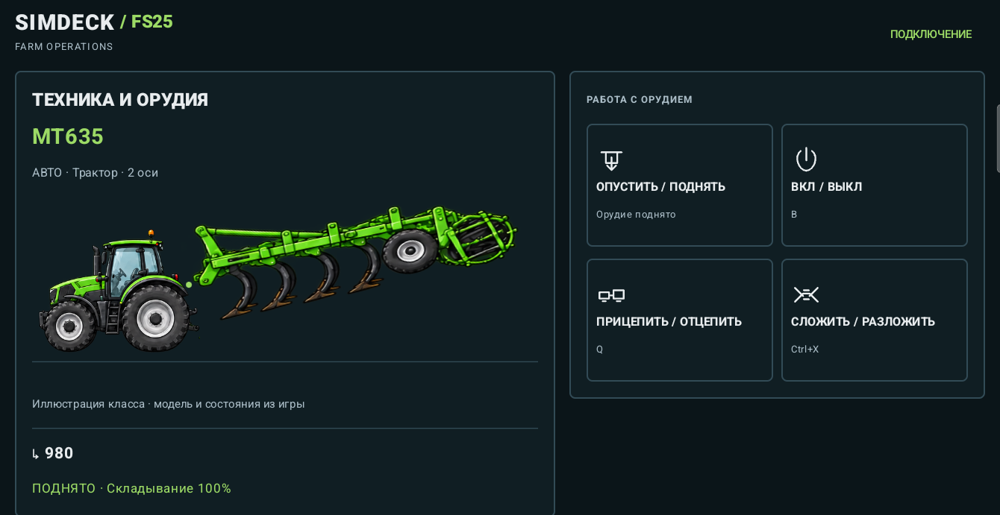 | 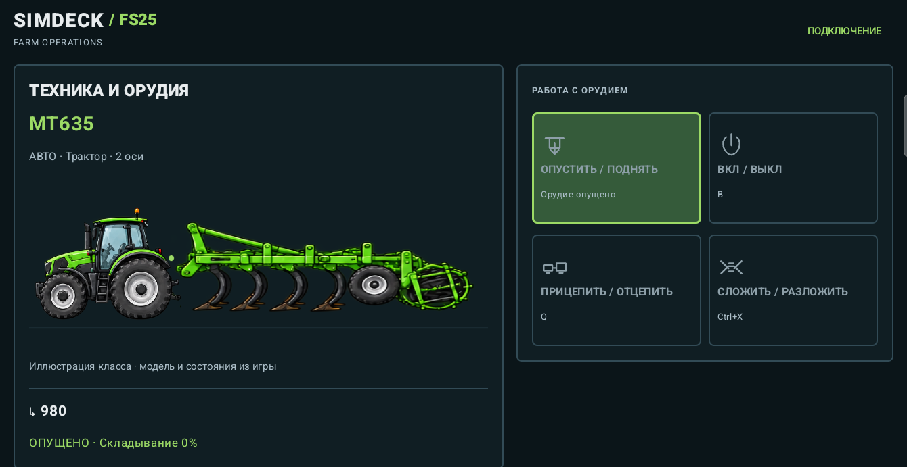 |

Системные панели обрезаны. IP, коды и настройки подключения в снимки не включены.

## Галерея браузера с тестовыми показаниями

| Профиль | Планшет | Телефон |
|---|---|---|
| F1 24 |  | 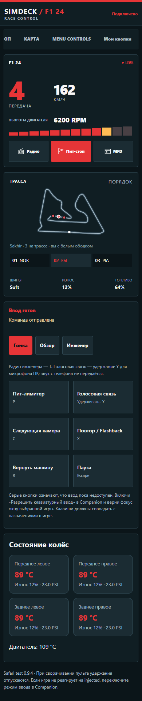 |
| F1 25 | 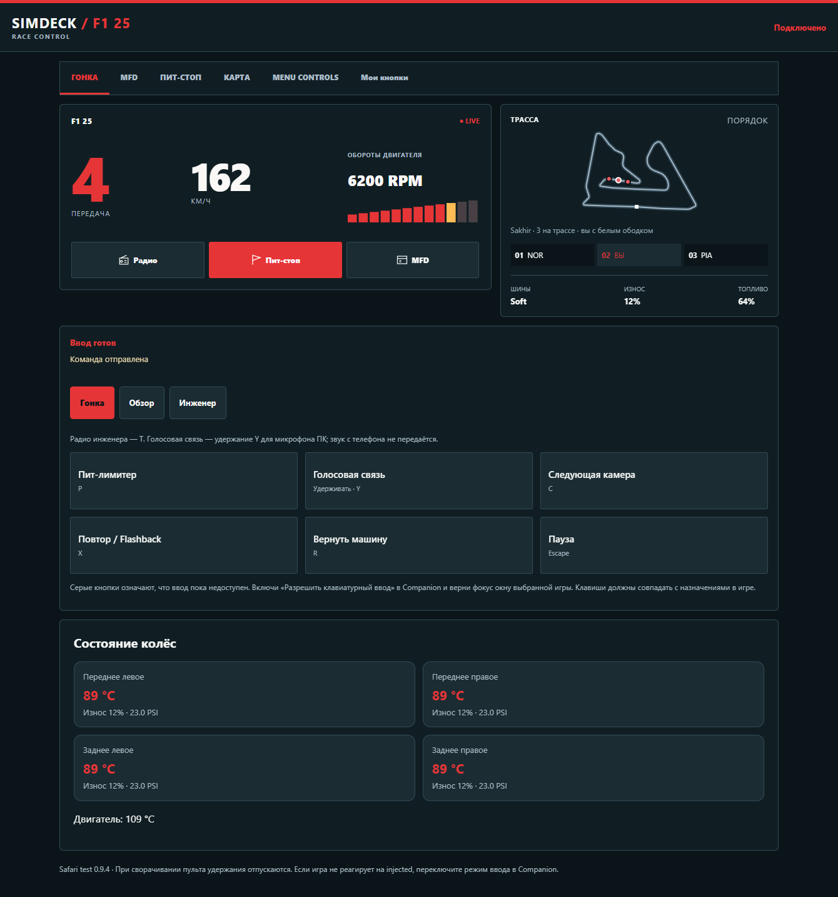 |  |
| BeamNG | 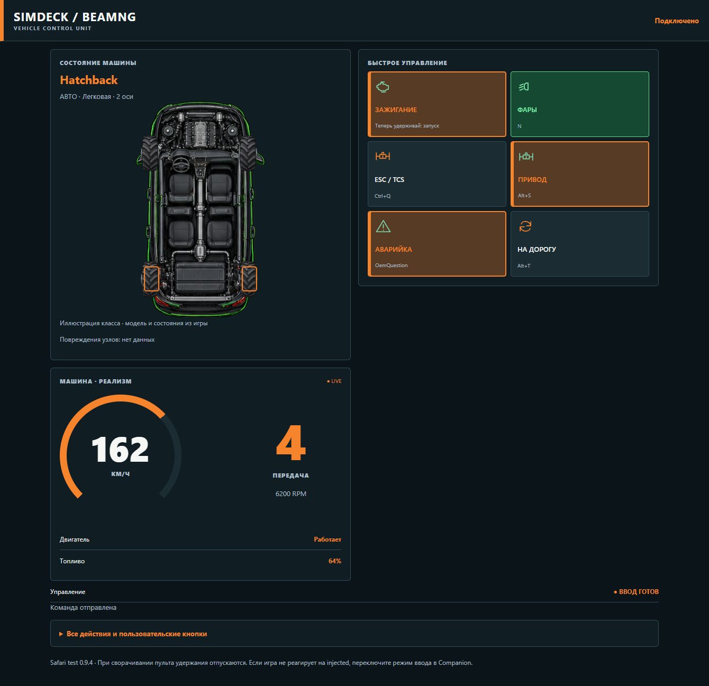 | 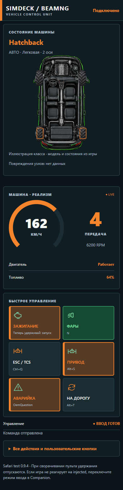 |
| ACC | 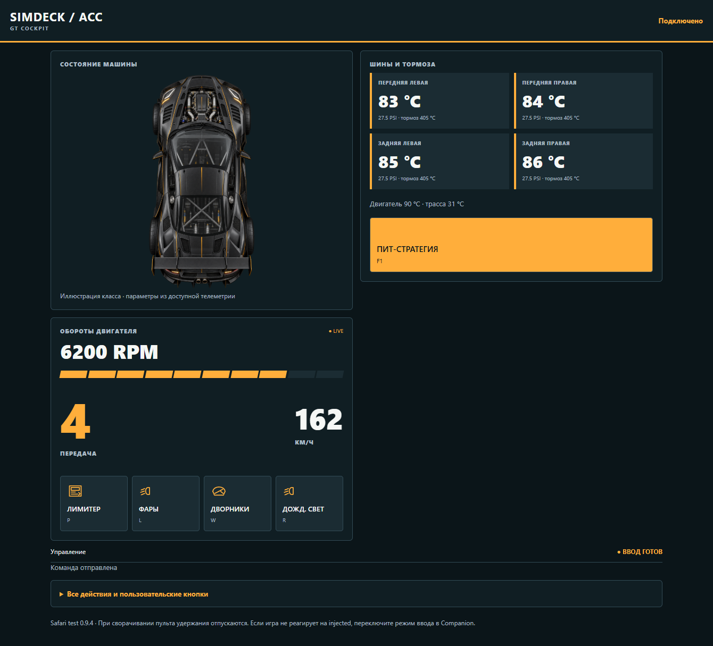 | 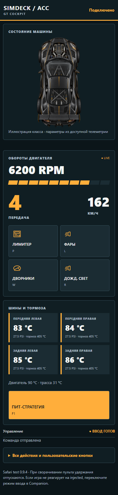 |
| AMS2 | 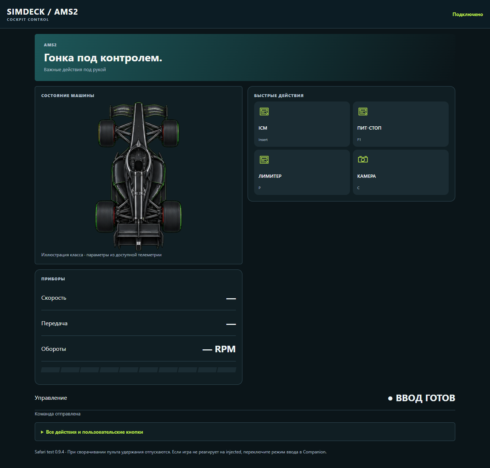 | 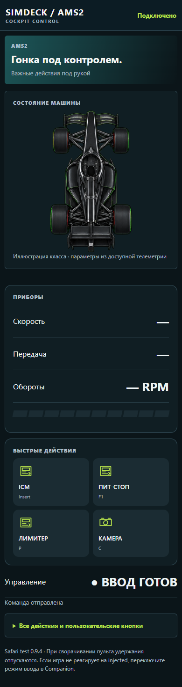 |
| ETS2 | 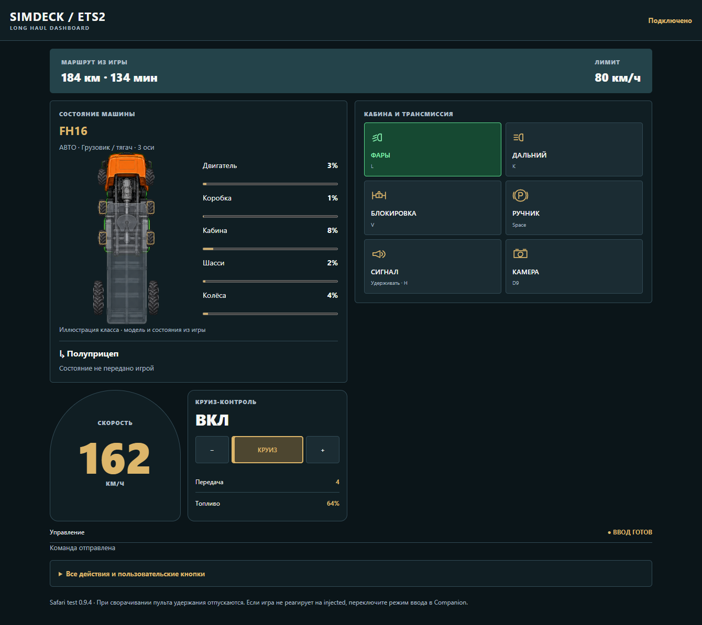 | 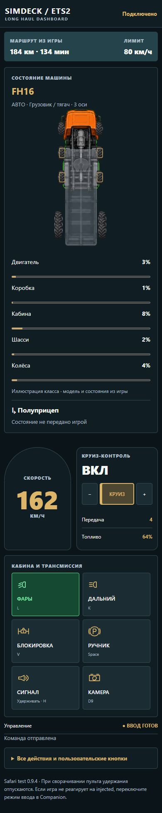 |
| SnowRunner | 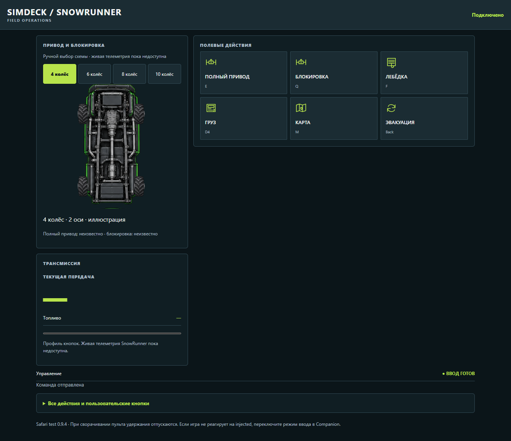 | 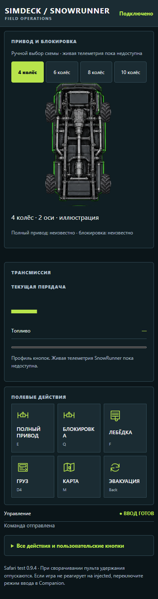 |
| FS25 | 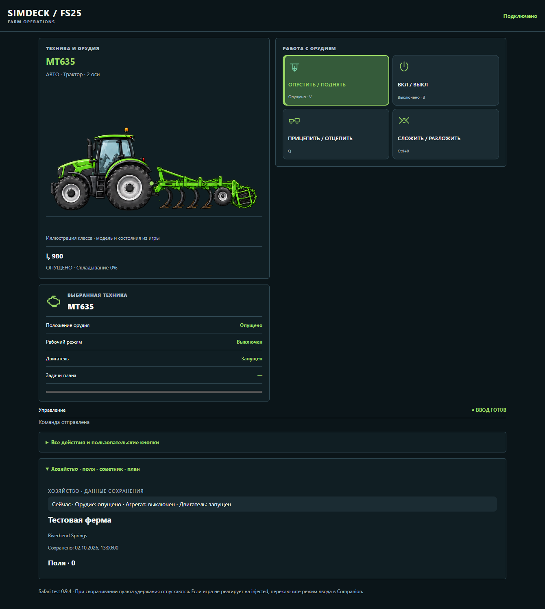 | 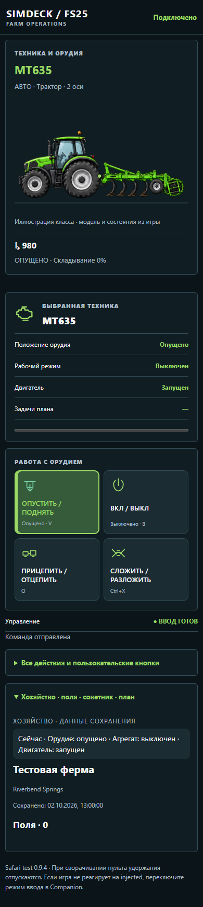 |

### F1: шины и повреждения переднего крыла

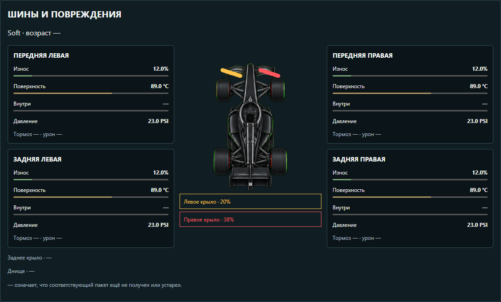

### FS25: присоединённый культиватор

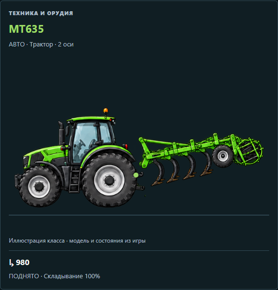

### ETS2: прозрачный подключённый прицеп

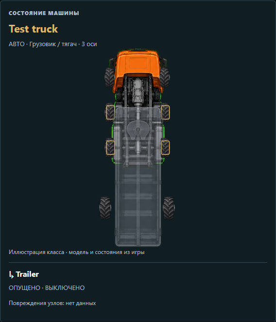

## Границы реализации

FS25 поддерживает живое положение первого присоединённого орудия и текстовую цепочку оборудования; дополнительные классы показываются отдельными иллюстрациями. Фаза складывания выводится числом, а не выдуманной геометрией каждого инструмента. ETS2 показывает агрегированный износ и маршрутные числа, без карты дорог. BeamNG пока не передаёт повреждения отдельных деталей. В SnowRunner выбор числа колёс ручной и AWD/блокировка неизвестны; AMS2 не имеет живого адаптера. Нет свежих данных — старые значения очищаются.

[Воспроизведение](../tools/qa/README.md) · [Автоматический выбор техники](AUTO-VEHICLE.md).
