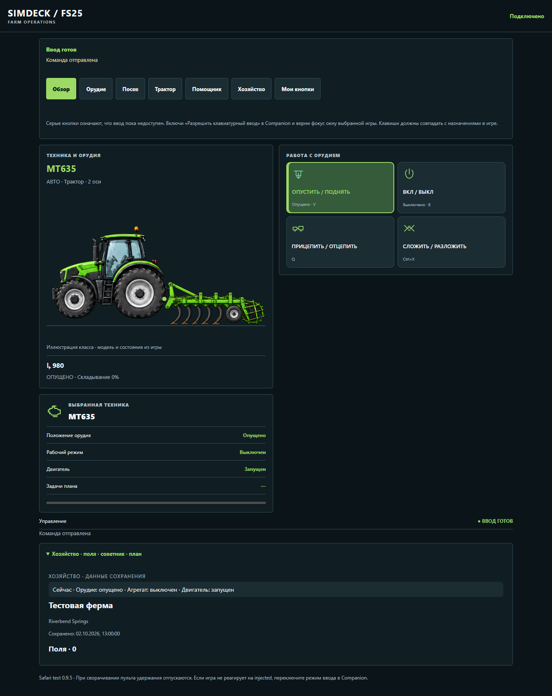
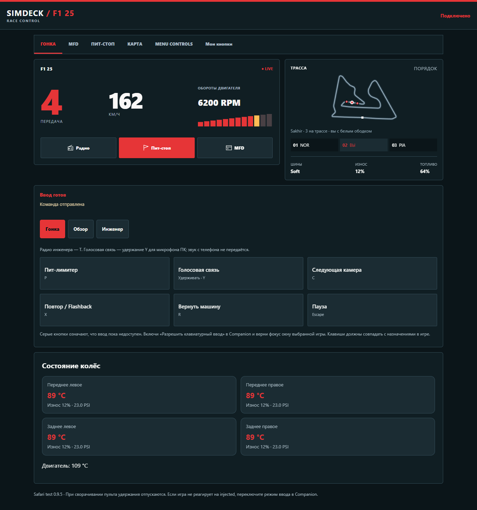
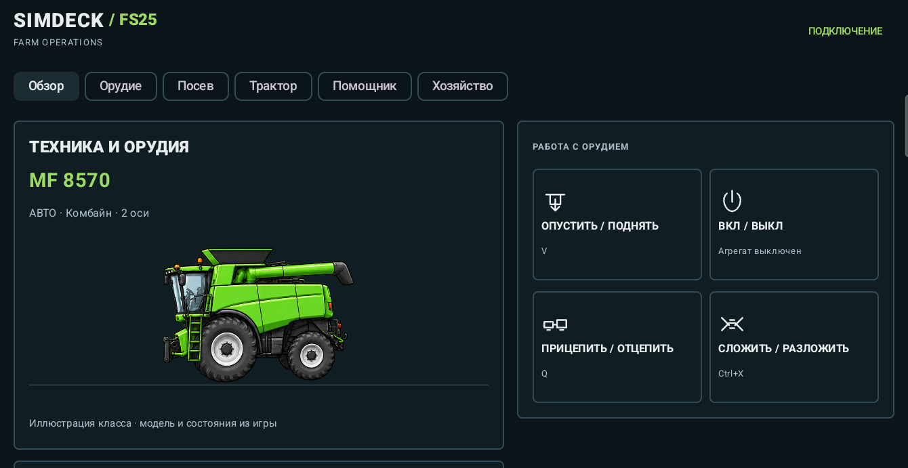
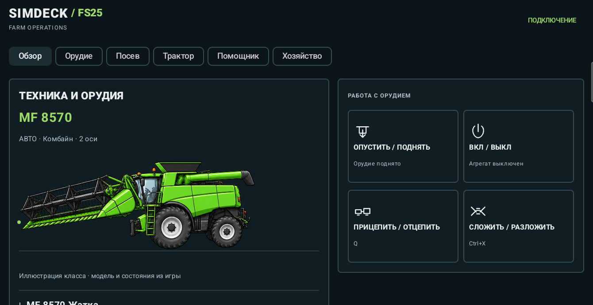

# Исправления техники и вкладок · SimDeck 0.9.5

Все настроенные страницы действий доступны рядом с «Обзор» в Android и Safari. Названия берутся из профиля, включая пользовательские страницы. F1 24/25 сохраняют свои разделы Control Scheme, MFD и Menu Controls.

FS25-мод **1.2.0.0** отдельно определяет жатку, плуг, культиватор и сеялку, передаёт место крепления front/rear/unknown. Комбайн без присоединённой жатки рисуется без неё. Неизвестное орудие получает название и сообщение об отсутствии схемы; оно не подменяется плугом. Иллюстрации показывают класс, а не точную модель или цвет конкретной машины.

При пропадании телеметрии последняя известная техника остаётся с явной отметкой устаревания. Живые показания и состояния кнопок очищаются. Подтверждённый выход из техники, отсоединение и смена профиля обновляют или очищают схему. Это исправление отображения не устраняет причину сетевых обрывов.

## Проверка

- Сборка Android, **53 unit-теста** и установка APK 0.9.5 на подключённый планшет.
- .NET: **301 проверка**, включая чтение типа/крепления жатки и её отсоединения; локальная выдача всех пяти PNG без текстовой порчи.
- Lua: вложенные орудия, циклы сцепки, пересадка, выход, присоединённая передняя жатка и отсоединение.
- Chromium и WebKit: восемь профилей на 320×640, 390×844, 844×390, 800×1340 и 1340×800. Все настроенные и пользовательские кнопки доступны; проверены удержание/отпускание, выключенный ввод, устаревшие данные, жатка и отсутствие выдуманного плуга.
- На настоящем Android проверены постоянные вкладки FS25 и открытие полной страницы «Орудие». На живом MF 8570 с отсоединённой жаткой новый мод передаёт пустую цепочку орудий, а приложение рисует комбайн без жатки и плуга. Командой Q с планшета жатка прицеплена: мод передал kind=header и mount=front, приложение показало её спереди. Повторной Q жатка отсоединена и исчезла после свежего кадра.

Браузерные снимки ниже используют синтетические данные. WebKit на Windows не заменяет проверку физического iPhone. Живые проверки остальных игр выполняются отдельно; телеметрия AMS2/SnowRunner, карта дорог ETS2 и повреждения отдельных узлов BeamNG в этот выпуск не добавлены.

| FS25 · все страницы сверху | F1 25 · сохранённые разделы |
|---|---|
|  |  |

## Живой Android: комбайн без жатки

Системные панели обрезаны; снимок не содержит сетевого адреса или кода сопряжения.

## Новый ресурс

[harvest.png](../assets/vehicles/harvest.png), RGBA 1254×1254, создан встроенным imagegen. Стилевой референс: существующий farm.png. Четыре независимых объекта: комбайн без жатки, снятая жатка, культиватор, плуг. Клиенты используют отдельные прямоугольники атласа.

Полный промпт:

> Use case: stylized-concept. Production transparent sprite atlas for agricultural dashboard, matching the detailed side-view machinery illustration style of the reference image (reference style only). Make a square 1024x1024 atlas in exactly four equally sized 512x512 cells. All objects face LEFT, full strict side elevation, isolated actual transparent background, no shadow/backdrop/glow/text/logos. Keep each entirely within its cell with 35 pixels margin. TOP LEFT: green wheel combine harvester body WITHOUT ANY cutter/header at all, empty front feeder attachment mount, large front tyre and smaller rear tyre, clearly a bare combine. TOP RIGHT: ONLY a detached green grain cutting header with black reel, seen side elevation, no combine/body/tyres/tractor. BOTTOM LEFT: ONLY a green cultivator with many short soil tines and packer roller, no vehicle. BOTTOM RIGHT: ONLY a separate agricultural mouldboard plough with distinct silver curved blades, no vehicle. Exactly four objects, physically separate. Crucial: combine has NO header, NO cutter, NO plough; header is independent sprite. No coloured rectangles or scenery.
