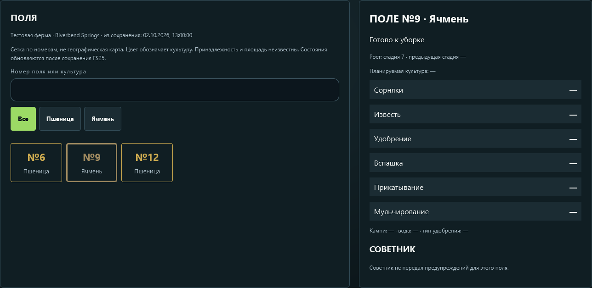
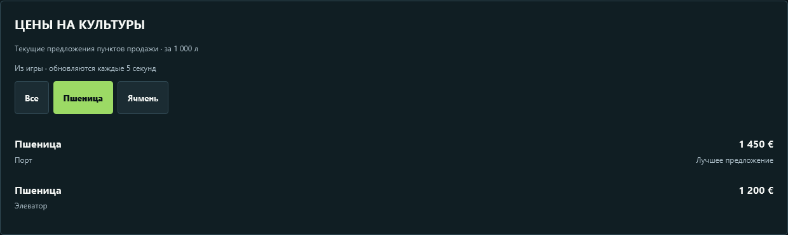
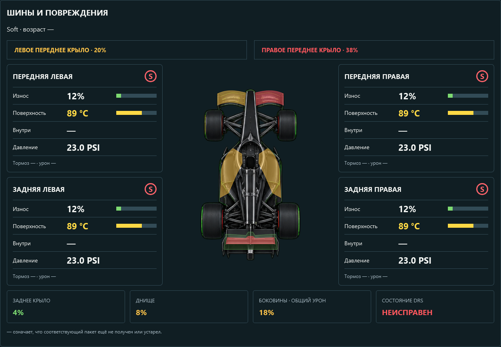

# SimDeck 0.9.10

Обновляйте Windows Companion и Android APK вместе. Для FS25 дополнительно замените мод на версию **1.4.0.0** при полностью закрытой игре и включите его для своего сохранения.

## FS25: поля и цены

На странице «Поля» известные шкалы отображаются в процентах: сорняки — из 9, известь и удобрение — из 3, вспашка, прикатывание и мульчирование — из 1. Например, 3/9 означает 33%. Стадия роста остаётся стадией; неизвестные значения не превращаются в ноль. Эти сведения читаются из сохранения, поэтому изменения в игре становятся видны после сохранения фермы.

Отдельная вкладка **«Цены»** получает текущие предложения продажи из запущенной игры через мод SimDeck. Можно выбрать продукт и сравнить покупателей; предложения сортируются от дорогого к дешёвому. Суммы показываются в валюте игры **за 1 000 л**, включая текущие игровые коэффициенты. Они не берутся из справочника или синтетического сохранения.

Мод собирает цены раз в пять секунд независимо от выбранной машины. Состояние техники передаётся отдельным небольшим файлом каждые 200 мс. При остановке источника сохраняются последние суммы с отметкой задержки.

1. Скачайте `FS25_SimDeckStatus.zip` из релиза.
2. Полностью закройте FS25 и положите ZIP без распаковки в `Documents/My Games/FarmingSimulator2025/mods`, заменив предыдущую версию.
3. Запустите игру и включите «SimDeck: состояние орудий» для сохранения.
4. Загрузите ферму, выберите FS25 в Companion и откройте «Цены» на пульте.





Скриншоты выше показывают проверочные данные интерфейса. Конкретные суммы, товары и пункты продажи зависят от карты и сохранения.

Живая проверка на Riverbend Springs: все шесть покупателей пшеницы и суммы совпали с игровым меню. На Android проверены выбор винограда, семь покупателей и сортировка по цене. Убрана ошибочная фильтрация `appearsOnStats`: этот флаг не означает отсутствие станции в меню цен и исключал мельницу, железнодорожного покупателя и речные терминалы.

## F1: окраска повреждённых деталей

F1 24 и F1 25 используют общие маски передних крыльев, боковин, заднего крыла и створки DRS. Цвет накладывается на поверхность детали и сохраняет текстуру схемы: до 5% — зелёный, до 30% — жёлтый, выше — красный. Неизвестные показания не обозначаются исправными.

Неисправность DRS — отдельный игровой флаг, а не процент повреждения. При неисправности створка красная; при известном исправном механизме учитывается повреждение заднего крыла.



## Android: подключение по USB

Проводной режим использует сохранённое сопряжение и тот же проверяемый сертификат Companion. Повторно вводить код для уже сопряжённого ПК не требуется.

1. Установите [Android SDK Platform Tools](https://developer.android.com/tools/releases/platform-tools) на ПК.
2. Включите отладку USB на Android, подключите кабель передачи данных и самостоятельно подтвердите разрешение отладки для своего ПК.
3. При работающем Companion выполните в папке Platform Tools:

   ```powershell
   .\adb.exe reverse tcp:9443 tcp:9443
   ```

4. На странице соединения SimDeck выберите **«USB · сохранённый ПК»**.
5. Для возврата выберите **«Wi-Fi · сохранённый ПК»**. После переподключения кабеля или перезапуска ADB перенаправление может потребоваться повторить.

Эта процедура предназначена для Android; Safari на iPhone продолжает использовать локальную сеть. ADB не устанавливается автоматически вместе с Companion. USB исключает участок Wi-Fi, но не ускоряет чтение сохранений или внутренние интервалы источников игры.

В проведённой короткой проверке USB счётчик переподключений не увеличивался не менее трёх минут. Это не означает проверку длительной сессии или всех кабелей и устройств.
